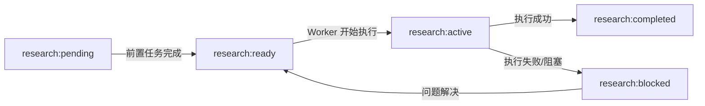

# Research Chain Campaign - 标签说明

## 概述

Research Chain Campaign 使用 GitHub Issue 标签来管理调研任务的状态流转。

## 需要创建的标签

在使用 Research Chain Campaign 之前，需要在仓库中创建以下标签：

### 任务状态标签

| 标签名称 | 颜色代码 | 描述 |
|---------|---------|------|
| `research:pending` | `#FEF2C0` | 等待执行（前置任务未完成） |
| `research:ready` | `#0E8A16` | 可以执行（前置任务已完成） |
| `research:active` | `#1D76DB` | 正在执行中 |
| `research:completed` | `#5319E7` | 已完成 |
| `research:blocked` | `#D93F0B` | 被阻塞（需要人工介入） |

### 追踪标签

| 标签名称 | 颜色代码 | 描述 |
|---------|---------|------|
| `campaign:research-chain` | `#0075CA` | Research Chain Campaign 的追踪标签 |
| `research-task` | `#C5DEF5` | 调研任务标识 |
| `auto-scheduled` | `#EDEDED` | 自动调度的任务 |

## 创建标签的方法

### 方法 1: 使用 GitHub Web UI

1. 进入仓库的 **Issues** 页面
2. 点击 **Labels** 按钮
3. 点击 **New label** 按钮
4. 输入标签名称、描述和颜色代码
5. 点击 **Create label**

### 方法 2: 使用 GitHub CLI

```bash
# 任务状态标签
gh label create "research:pending" --color FEF2C0 --description "等待执行（前置任务未完成）"
gh label create "research:ready" --color 0E8A16 --description "可以执行（前置任务已完成）"
gh label create "research:active" --color 1D76DB --description "正在执行中"
gh label create "research:completed" --color 5319E7 --description "已完成"
gh label create "research:blocked" --color D93F0B --description "被阻塞（需要人工介入）"

# 追踪标签
gh label create "campaign:research-chain" --color 0075CA --description "Research Chain Campaign 的追踪标签"
gh label create "research-task" --color C5DEF5 --description "调研任务标识"
gh label create "auto-scheduled" --color EDEDED --description "自动调度的任务"
```

## 状态流转图



## 标签使用规则

### Planner (导师 Agent) 的职责

- 创建 Issue 时，第一个任务打上 `research:ready` 标签
- 其他任务打上 `research:pending` 标签
- 所有任务都打上 `campaign:research-chain` 和 `research-task` 标签

### Worker (科研员 Agent) 的职责

- 执行前：移除 `research:ready`，添加 `research:active`
- 执行成功：移除 `research:active`，添加 `research:completed`
- 执行失败：移除 `research:active`，添加 `research:blocked`
- 完成后：为下一个任务添加 `research:ready`，移除 `research:pending`

### 人工干预

当任务被标记为 `research:blocked` 时，需要人工：

1. 检查 Issue 评论了解阻塞原因
2. 解决问题后，移除 `research:blocked`
3. 添加 `research:ready` 重新触发执行

## 注意事项

⚠️ **重要**：在首次运行 Research Chain Planner 之前，必须先创建所有必需的标签，否则工作流可能会失败。
