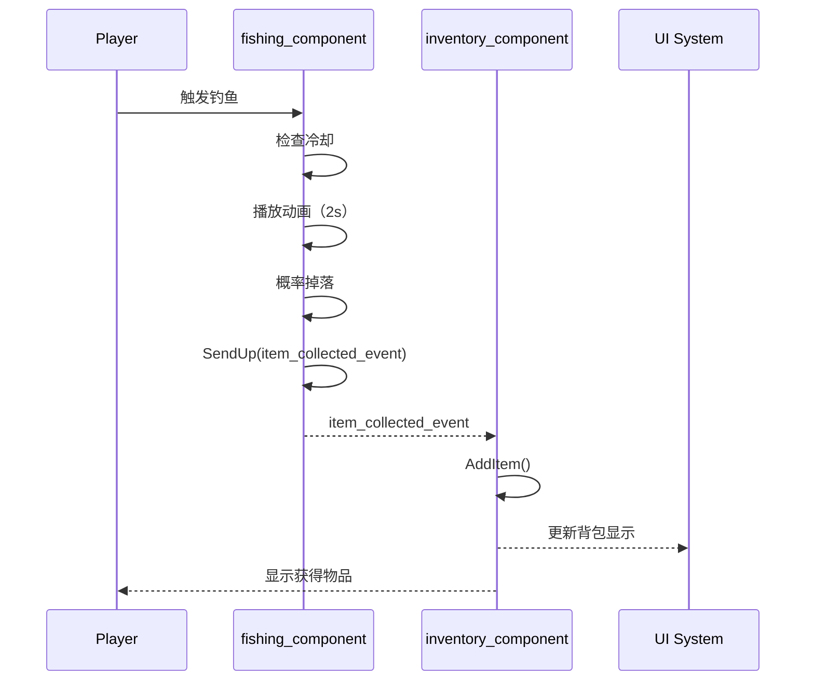
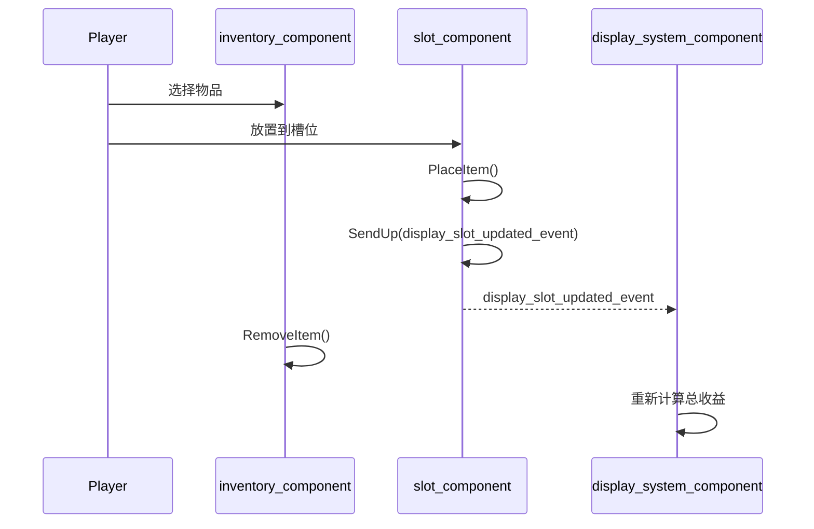
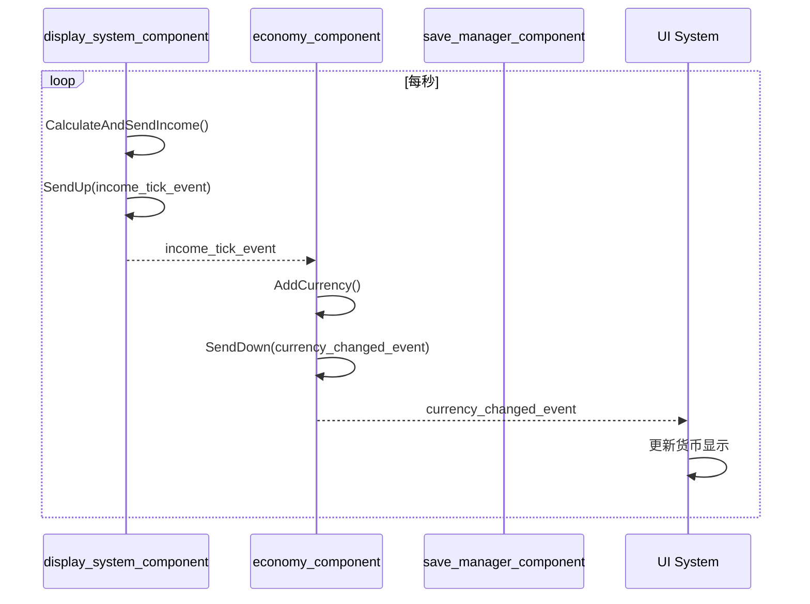

# 架构设计

> **项目名称**：岛屿养成游戏  
> **最后更新**：2025-12-25

---

## 架构概述

### 核心原则

1. **SceneGraph 优先**：使用实体-组件-事件模式，**不使用 CreativeDevice**
2. **单向数据流**：事件驱动状态变更，避免双向绑定
3. **组件单一职责**：每个 Component 只负责一件事
4. **松耦合通信**：组件间通过 Scene Events 通信，不直接引用

### 架构模式

```
┌─────────────────────────────────────────────────────────────┐
│                    SceneGraph 架构                          │
├─────────────────────────────────────────────────────────────┤
│  Entity（实体）：场景中的节点容器                            │
│  Component（组件）：附加在实体上的行为和数据                  │
│  Scene Event（事件）：组件间的通信机制                       │
└─────────────────────────────────────────────────────────────┘
```

---

## 实体层级结构

```
simulation_entity (根实体)
│
├── game_manager_entity                  # 🎮 游戏管理器
│   ├── economy_component                # 全局经济管理
│   ├── save_manager_component           # 存档管理
│   └── game_state_component             # 游戏状态
│
├── player_manager_entity                # 👥 玩家管理器
│   └── (动态创建玩家基地)
│
├── player_base_entity (per-player)      # 🏠 玩家基地
│   ├── display_system_component         # 展示系统管理
│   ├── inventory_component              # 背包
│   ├── income_generator_component       # 收入生成
│   │
│   └── display_slot_entity[12]          # 📦 展示槽位 x12
│       └── slot_component               # 槽位逻辑
│
├── main_island_entity                   # 🏝️ 主岛
│   ├── fishing_zone_entity              # 🎣 钓鱼区
│   │   └── fishing_component
│   │
│   └── portal_hub_entity                # 🌀 传送门中心
│       └── portal_entity[]              # 传送门
│
└── theme_island_entity[]                # 🌲 主题岛（扩展）
    └── forest_island_entity
        ├── mining_zone_component
        └── random_spawn_component
```

---

## 组件职责矩阵

### 核心组件

| 组件 | 职责 | 数据 | 事件（发送） | 事件（监听） |
|------|------|------|--------------|--------------|
| `slot_component` | 管理单个槽位的物品 | CurrentItem, IsUnlocked | `display_slot_updated_event` | - |
| `display_system_component` | 管理所有槽位，计算总收益 | Slots[], UnlockedSlotCount | `income_tick_event` | - |
| `fishing_component` | 处理钓鱼逻辑和掉落 | LastFishTime, IsFishing | `item_collected_event` | - |
| `inventory_component` | 管理玩家背包 | Items[], Capacity | - | `item_collected_event` |
| `economy_component` | 管理货币增减 | PlayerCurrency | `currency_changed_event` | `income_tick_event` |
| `save_manager_component` | 存档加载和保存 | LastSaveTime | - | - |

### 组件交互图

```
┌─────────────────┐     item_collected_event     ┌──────────────────┐
│ fishing_        │ ────────────────────────────▶│ inventory_       │
│ component       │                              │ component        │
└─────────────────┘                              └──────────────────┘
                                                          │
                                                          │ 玩家放置物品
                                                          ▼
┌─────────────────┐   display_slot_updated_event ┌──────────────────┐
│ slot_           │ ────────────────────────────▶│ display_system_  │
│ component       │                              │ component        │
└─────────────────┘                              └──────────────────┘
                                                          │
                                                          │ income_tick_event
                                                          ▼
┌─────────────────┐   currency_changed_event     ┌──────────────────┐
│ economy_        │ ────────────────────────────▶│ UI / Save        │
│ component       │                              │ System           │
└─────────────────┘                              └──────────────────┘
```

---

## 事件系统设计

### 事件定义

```verse
# === 物品相关事件 ===

# 物品收集（钓鱼/挖矿/随机获得）
item_collected_event := class<concrete>(scene_event):
    Player:player           # 收集者
    Item:item_type          # 物品类型
    Source:string           # 来源："fishing"|"mining"|"random"

# === 槽位相关事件 ===

# 槽位内容变更
display_slot_updated_event := class<concrete>(scene_event):
    SlotIndex:int           # 槽位索引
    PreviousItem:?item_type # 之前的物品（可空）
    NewItem:?item_type      # 新物品（可空）

# 槽位解锁
slot_unlocked_event := class<concrete>(scene_event):
    Player:player
    SlotIndex:int

# === 经济相关事件 ===

# 收入结算（每秒触发）
income_tick_event := class<concrete>(scene_event):
    Player:player
    Amount:int              # 本次收入
    Sources:[]slot_income_entry  # 各槽位贡献明细

# 货币变更
currency_changed_event := class<concrete>(scene_event):
    Player:player
    PreviousAmount:int
    NewAmount:int
    Reason:string           # "income"|"purchase"|"sell"|"refund"

# === 辅助结构 ===
slot_income_entry := struct:
    SlotIndex:int
    ItemId:string
    Income:int
```

### 事件传播方向

| 事件 | 传播方式 | 说明 |
|------|----------|------|
| `item_collected_event` | `SendUp` | 从收集点向上传播到玩家基地 |
| `display_slot_updated_event` | `SendUp` | 从槽位向上传播到展示系统 |
| `income_tick_event` | `SendUp` | 从展示系统向上传播到经济系统 |
| `currency_changed_event` | `SendDown` | 从经济系统向下广播 |
| `slot_unlocked_event` | `SendUp` | 从展示系统向上传播 |

---

## 数据结构设计

### 物品类型

```verse
# 稀有度
item_rarity := enum:
    Common      # 普通 - 基础倍率 1.0
    Uncommon    # 罕见 - 倍率 1.5
    Rare        # 稀有 - 倍率 2.5
    Epic        # 史诗 - 倍率 4.0
    Legendary   # 传说 - 倍率 7.0

# 物品定义
item_type := class<concrete>:
    Id:string                   # 唯一标识
    DisplayName:string          # 显示名称
    Rarity:item_rarity          # 稀有度
    BaseIncomePerSecond:float   # 基础收益/秒
    
    GetActualIncome():float =   # 计算实际收益
        BaseIncomePerSecond * GetRarityMultiplier(Rarity)
```

### 背包条目

```verse
inventory_entry := struct:
    Item:item_type
    Quantity:int
```

### 存档数据

```verse
player_save_data := struct:
    Currency:int
    UnlockedSlots:int
    SlotData:[]slot_save_data
    InventoryData:[]inventory_save_data
    TotalPlayTime:float
    LastSaveTime:float

slot_save_data := struct:
    SlotIndex:int
    ItemId:string      # 空 = 无物品
    IsUnlocked:logic

inventory_save_data := struct:
    ItemId:string
    Quantity:int
```

---

## 系统交互流程

### 核心循环流程

```
┌─────────┐    ┌─────────┐    ┌─────────┐    ┌─────────┐    ┌─────────┐
│  钓鱼   │───▶│  背包   │───▶│  放置   │───▶│  收益   │───▶│  升级   │
│ Fishing │    │Inventory│    │ Display │    │ Income  │    │ Upgrade │
└─────────┘    └─────────┘    └─────────┘    └─────────┘    └─────────┘
     │              │              │              │              │
     ▼              ▼              ▼              ▼              ▼
item_collected  添加物品    slot_updated   income_tick   slot_unlocked
    event                      event          event         event
```

### 详细流程图

#### 1. 钓鱼获取物品



#### 2. 放置物品到槽位



#### 3. 收益结算



---

## 文件组织

```
Verse/
├── Entities/
│   ├── simulation_entity.verse         # 根实体
│   ├── game_manager_entity.verse       # 游戏管理器
│   ├── player_base_entity.verse        # 玩家基地
│   ├── display_slot_entity.verse       # 展示槽位
│   ├── fishing_zone_entity.verse       # 钓鱼区域
│   └── portal_entity.verse             # 传送门
│
├── Components/
│   ├── slot_component.verse            # 槽位组件
│   ├── display_system_component.verse  # 展示系统
│   ├── fishing_component.verse         # 钓鱼组件
│   ├── inventory_component.verse       # 背包组件
│   ├── economy_component.verse         # 经济组件
│   ├── income_generator_component.verse # 收入生成器
│   ├── save_manager_component.verse    # 存档管理器
│   └── upgrade_shop_component.verse    # 升级商店
│
├── Events/
│   └── core_events.verse               # 所有事件定义
│
├── Data/
│   ├── item_types.verse                # 物品类型定义
│   ├── item_config.verse               # 物品配置表
│   └── save_data.verse                 # 存档数据结构
│
└── Utils/
    └── constants.verse                 # 全局常量
```

---

## 扩展点

### 预留的扩展接口

| 扩展点 | 位置 | 说明 |
|--------|------|------|
| 新物品类型 | `item_config.verse` | 添加新物品到配置表 |
| 新收集方式 | 新建 `*_component.verse` | 实现类似 fishing_component 的组件 |
| 新主题岛 | `theme_island_entity` | 添加新的岛屿实体 |
| 新升级类型 | `upgrade_shop_component` | 添加新的购买方法 |
| 物品合成 | 新建 `crafting_component` | 后续版本实现 |

### 扩展原则

1. **新功能优先新组件**：不修改现有组件，而是添加新组件
2. **通过事件集成**：新组件通过订阅/发送事件与现有系统交互
3. **配置驱动**：数值变化通过修改 Data/ 下的配置，不改代码

---

## 性能考量

### 关键路径优化

| 操作 | 频率 | 目标 | 优化策略 |
|------|------|------|----------|
| 收益计算 | 每秒 | < 1ms | 缓存槽位收益，仅在变化时重算 |
| 存档 | 每 60s | < 100ms | 异步写入，不阻塞主线程 |
| 物品掉落 | 每次钓鱼 | < 10ms | 预计算概率表 |

### 内存管理

- 物品配置表：游戏启动时加载，常驻内存
- 槽位数据：最多 12 个，内存可忽略
- 背包数据：最多 50 条目，使用结构数组

---

## 参考文档

- [SceneGraph 框架详解](../../uefn-dev/references/scenegraph-framework-guide.md)
- [SceneGraph API 参考](../../uefn-dev/references/scenegraph-api-reference.md)
- [游戏设计文档](./references/game-design-doc.md)
- [实施计划](./@implementation-plan.md)
