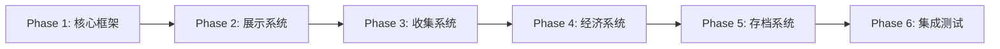
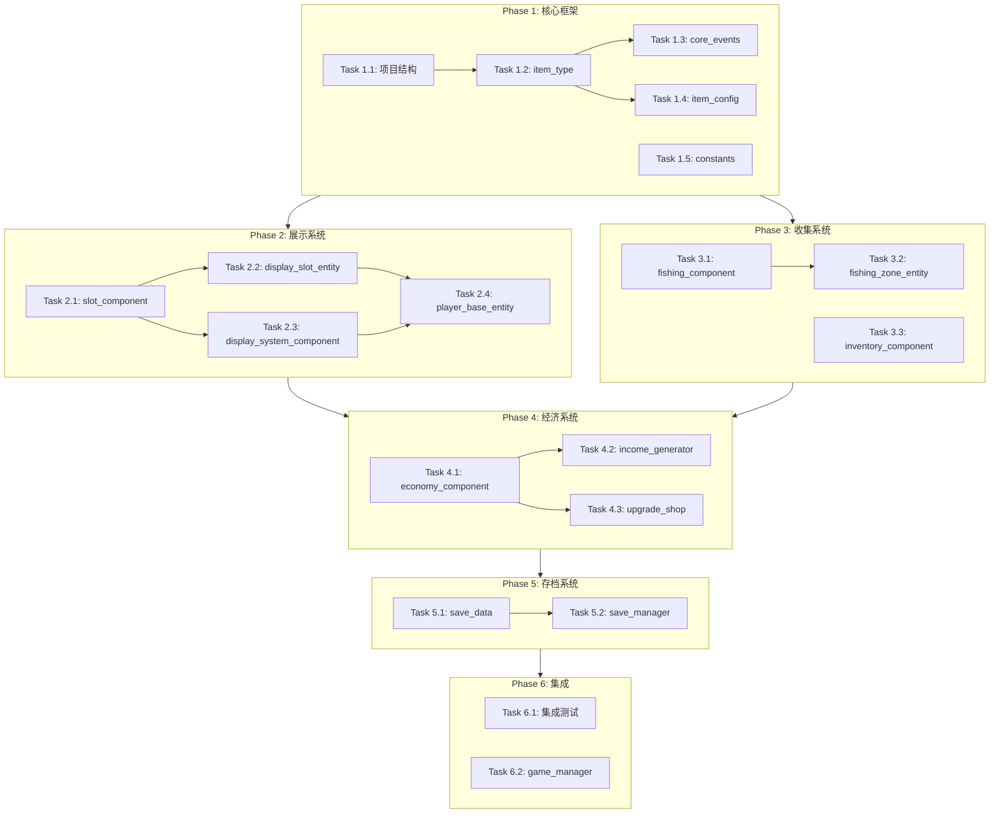

# 实施计划

> **项目名称**：岛屿养成游戏  
> **最后更新**：2025-12-25  
> **计划粒度**：Component 级别（单次任务可完成单个/同系统多个 Component）

---

## 目录

- [MVP 阶段总览](#mvp-阶段总览)
- [Phase 1: 核心框架](#phase-1-核心框架)
- [Phase 2: 展示系统](#phase-2-展示系统)
- [Phase 3: 收集系统](#phase-3-收集系统)
- [Phase 4: 经济系统](#phase-4-经济系统)
- [Phase 5: 存档系统](#phase-5-存档系统)
- [Phase 6: 集成测试](#phase-6-集成测试)

---

## MVP 阶段总览



### MVP 目标

**可玩的核心循环**：玩家可以钓鱼获取物品 → 放置到展示槽 → 产生收益 → 购买升级 → 存档保持进度

### 范围边界

| 包含 | 不包含 |
|------|--------|
| 钓鱼系统 | 主题岛屿 |
| 展示槽位（4 个初始） | 复杂合成系统 |
| 被动收益 | 社交功能 |
| 基础升级 | 排行榜 |
| 自动存档 | 成就系统 |

---

## Phase 1: 核心框架

**目标**：搭建 SceneGraph 基础架构，定义核心数据结构和事件

### Task 1.1: 项目结构初始化

**类型**：Setup  
**预估**：1 小时  
**前置**：无

**交付物**：
```
Verse/
├── Entities/
│   └── simulation_entity.verse     # 根实体
├── Components/
│   └── (空目录)
├── Events/
│   └── core_events.verse           # 核心事件定义
├── Data/
│   ├── item_types.verse            # 物品类型枚举
│   └── item_config.verse           # 物品配置数据
└── Utils/
    └── constants.verse             # 全局常量
```

**验收标准**：
- [ ] 项目可编译通过
- [ ] 目录结构清晰

---

### Task 1.2: item_type 数据结构

**类型**：Data  
**预估**：30 分钟  
**前置**：Task 1.1

**代码内容**：

```verse
# Data/item_types.verse

# 稀有度枚举
item_rarity := enum:
    Common
    Uncommon
    Rare
    Epic
    Legendary

# 物品类型定义
item_type := class<concrete>:
    @editable Id:string
    @editable DisplayName:string
    @editable Rarity:item_rarity
    @editable BaseIncomePerSecond:float
    @editable Icon:texture  # 可选，后续补充
    
    # 根据稀有度计算实际收益
    GetActualIncome():float =
        RarityMultiplier := case(Rarity):
            item_rarity.Common => 1.0
            item_rarity.Uncommon => 1.5
            item_rarity.Rare => 2.5
            item_rarity.Epic => 4.0
            item_rarity.Legendary => 7.0
        BaseIncomePerSecond * RarityMultiplier
```

**验收标准**：
- [ ] item_type 类可实例化
- [ ] 稀有度影响收益计算正确

---

### Task 1.3: core_events 事件定义

**类型**：Events  
**预估**：30 分钟  
**前置**：Task 1.2

**代码内容**：

```verse
# Events/core_events.verse

# 物品收集事件 - 当玩家获得新物品时触发
item_collected_event := class<concrete>(scene_event):
    Player:player
    Item:item_type
    Source:string  # "fishing" | "mining" | "random"

# 展示槽位更新事件 - 当槽位内容变化时触发
display_slot_updated_event := class<concrete>(scene_event):
    SlotIndex:int
    PreviousItem:?item_type
    NewItem:?item_type

# 收入结算事件 - 每秒触发一次
income_tick_event := class<concrete>(scene_event):
    Player:player
    Amount:int
    Sources:[]slot_income_entry  # 各槽位贡献

# 货币变更事件 - 货币增减时触发
currency_changed_event := class<concrete>(scene_event):
    Player:player
    PreviousAmount:int
    NewAmount:int
    Reason:string  # "income" | "purchase" | "sell"

# 槽位解锁事件
slot_unlocked_event := class<concrete>(scene_event):
    Player:player
    SlotIndex:int

# 辅助结构
slot_income_entry := struct:
    SlotIndex:int
    ItemId:string
    Income:int
```

**验收标准**：
- [ ] 所有事件类可编译
- [ ] 事件字段覆盖所有必要信息

---

### Task 1.4: item_config 物品配置表

**类型**：Data  
**预估**：1 小时  
**前置**：Task 1.2

**代码内容**：

```verse
# Data/item_config.verse

# MVP 物品配置（15 种）
GetAllItems():[]item_type =
    array:
        # === 普通 Common (5) ===
        item_type:
            Id := "small_fish"
            DisplayName := "小鱼"
            Rarity := item_rarity.Common
            BaseIncomePerSecond := 1.0
        item_type:
            Id := "stone"
            DisplayName := "石头"
            Rarity := item_rarity.Common
            BaseIncomePerSecond := 1.0
        item_type:
            Id := "branch"
            DisplayName := "树枝"
            Rarity := item_rarity.Common
            BaseIncomePerSecond := 1.0
        item_type:
            Id := "shell"
            DisplayName := "贝壳"
            Rarity := item_rarity.Common
            BaseIncomePerSecond := 1.0
        item_type:
            Id := "feather"
            DisplayName := "羽毛"
            Rarity := item_rarity.Common
            BaseIncomePerSecond := 1.0
            
        # === 罕见 Uncommon (4) ===
        item_type:
            Id := "medium_fish"
            DisplayName := "中鱼"
            Rarity := item_rarity.Uncommon
            BaseIncomePerSecond := 3.0
        item_type:
            Id := "iron_ore"
            DisplayName := "铁矿"
            Rarity := item_rarity.Uncommon
            BaseIncomePerSecond := 3.0
        item_type:
            Id := "mushroom"
            DisplayName := "蘑菇"
            Rarity := item_rarity.Uncommon
            BaseIncomePerSecond := 3.0
        item_type:
            Id := "flower"
            DisplayName := "花朵"
            Rarity := item_rarity.Uncommon
            BaseIncomePerSecond := 3.0
            
        # === 稀有 Rare (3) ===
        item_type:
            Id := "large_fish"
            DisplayName := "大鱼"
            Rarity := item_rarity.Rare
            BaseIncomePerSecond := 8.0
        item_type:
            Id := "gold_ore"
            DisplayName := "金矿"
            Rarity := item_rarity.Rare
            BaseIncomePerSecond := 8.0
        item_type:
            Id := "crystal"
            DisplayName := "水晶"
            Rarity := item_rarity.Rare
            BaseIncomePerSecond := 8.0
            
        # === 史诗 Epic (2) ===
        item_type:
            Id := "rare_fish"
            DisplayName := "稀有鱼"
            Rarity := item_rarity.Epic
            BaseIncomePerSecond := 20.0
        item_type:
            Id := "diamond"
            DisplayName := "钻石"
            Rarity := item_rarity.Epic
            BaseIncomePerSecond := 20.0
            
        # === 传说 Legendary (1) ===
        item_type:
            Id := "golden_fish"
            DisplayName := "金鱼王"
            Rarity := item_rarity.Legendary
            BaseIncomePerSecond := 50.0

# 通过 ID 查找物品
FindItemById(ItemId:string):?item_type =
    for (Item : GetAllItems()):
        if (Item.Id = ItemId):
            return option{Item}
    return false
```

**验收标准**：
- [ ] 15 种 MVP 物品全部配置
- [ ] `FindItemById` 函数正确返回

---

### Task 1.5: constants 全局常量

**类型**：Utils  
**预估**：20 分钟  
**前置**：无

**代码内容**：

```verse
# Utils/constants.verse

# 游戏平衡常量
GAME_CONSTANTS := class:
    # 初始状态
    INITIAL_CURRENCY:int = 0
    INITIAL_UNLOCKED_SLOTS:int = 4
    MAX_SLOTS:int = 12
    
    # 槽位解锁成本（指数增长）
    GetSlotUnlockCost(SlotIndex:int):int =
        BaseCost := 100
        Multiplier := 2.0
        Floor(BaseCost * Pow(Multiplier, SlotIndex - INITIAL_UNLOCKED_SLOTS))
    
    # 收益计算间隔（秒）
    INCOME_TICK_INTERVAL:float = 1.0
    
    # 钓鱼冷却（秒）
    FISHING_COOLDOWN:float = 3.0
    
    # 背包容量
    INVENTORY_CAPACITY:int = 50

# 钓鱼概率表
FISHING_DROP_TABLE := class:
    # 稀有度 -> 概率（百分比）
    GetRarityChance(Rarity:item_rarity):float =
        case(Rarity):
            item_rarity.Common => 60.0
            item_rarity.Uncommon => 25.0
            item_rarity.Rare => 10.0
            item_rarity.Epic => 4.0
            item_rarity.Legendary => 1.0
```

**验收标准**：
- [ ] 常量值符合 GDD 设计
- [ ] 槽位成本计算符合指数曲线

---

## Phase 2: 展示系统

**目标**：实现展示槽位，玩家可放置物品并产生收益

### Task 2.1: slot_component 槽位组件

**类型**：Component  
**预估**：1.5 小时  
**前置**：Phase 1 完成

**代码内容**：

```verse
# Components/slot_component.verse

slot_component := class<final>(component):
    @editable SlotIndex:int = 0
    
    var CurrentItem:?item_type = false
    var IsUnlocked:logic = false
    
    # 放置物品
    PlaceItem(Item:item_type)<transacts>:void =
        if (IsUnlocked?):
            OldItem := CurrentItem
            set CurrentItem = option{Item}
            # 发送槽位更新事件
            if (ParentEntity := GetParentEntity[]):
                ParentEntity.SendUp(display_slot_updated_event:
                    SlotIndex := SlotIndex
                    PreviousItem := OldItem
                    NewItem := CurrentItem
                )
    
    # 移除物品
    RemoveItem()<transacts>:?item_type =
        if (Item := CurrentItem):
            OldItem := CurrentItem
            set CurrentItem = false
            if (ParentEntity := GetParentEntity[]):
                ParentEntity.SendUp(display_slot_updated_event:
                    SlotIndex := SlotIndex
                    PreviousItem := OldItem
                    NewItem := false
                )
            return OldItem
        return false
    
    # 计算当前收益
    GetCurrentIncome():float =
        if (Item := CurrentItem):
            Item.GetActualIncome()
        else:
            0.0
    
    # 解锁槽位
    Unlock()<transacts>:void =
        set IsUnlocked = true
```

**验收标准**：
- [ ] 槽位可放置/移除物品
- [ ] 事件正确发送
- [ ] 收益计算正确

---

### Task 2.2: display_slot_entity 槽位实体

**类型**：Entity  
**预估**：1 小时  
**前置**：Task 2.1

**代码内容**：

```verse
# Entities/display_slot_entity.verse

display_slot_entity := class<final>(entity):
    @editable SlotIndex:int = 0
    @editable var SlotComponent:slot_component = slot_component{}
    
    # 可视化表示（Props）
    @editable DisplayProp:creative_prop_asset = DefaultDisplayProp
    @editable HighlightEffect:niagara_system_asset = DefaultHighlight
    
    var PropInstance:?creative_prop = false
    
    OnBegin<override>()<suspends>:void =
        # 初始化组件
        set SlotComponent.SlotIndex = SlotIndex
        
        # 生成展示道具
        SpawnDisplayProp()
        
        # 监听交互
        SetupInteraction()
    
    SpawnDisplayProp():void =
        if (SpawnedProp := SpawnProp(DisplayProp, GetTransform())):
            set PropInstance = option{SpawnedProp}
    
    SetupInteraction():void =
        # TODO: 绑定玩家交互事件
        pass
```

**验收标准**：
- [ ] 实体正确包含 slot_component
- [ ] 场景中可见展示位置

---

### Task 2.3: display_system_component 展示系统组件

**类型**：Component  
**预估**：2 小时  
**前置**：Task 2.1, Task 2.2

**代码内容**：

```verse
# Components/display_system_component.verse

display_system_component := class<final>(component):
    @editable MaxSlots:int = 12
    @editable InitialUnlockedSlots:int = 4
    
    var Slots:[]slot_component = array{}
    var UnlockedSlotCount:int = 4
    
    OnBegin<override>()<suspends>:void =
        # 收集所有子槽位组件
        CollectSlotComponents()
        
        # 初始化已解锁槽位
        InitializeSlots()
        
        # 启动收益循环
        spawn { IncomeLoop() }
    
    CollectSlotComponents():void =
        if (ParentEntity := GetParentEntity[]):
            for (Child : ParentEntity.GetChildren()):
                if (SlotComp := Child.GetComponent[slot_component]):
                    set Slots = Slots + array{SlotComp}
    
    InitializeSlots():void =
        for (Index -> Slot : Slots):
            if (Index < InitialUnlockedSlots):
                Slot.Unlock()
    
    IncomeLoop()<suspends>:void =
        loop:
            Sleep(GAME_CONSTANTS{}.INCOME_TICK_INTERVAL)
            CalculateAndSendIncome()
    
    CalculateAndSendIncome():void =
        var TotalIncome:int = 0
        var IncomeEntries:[]slot_income_entry = array{}
        
        for (Index -> Slot : Slots):
            Income := Floor(Slot.GetCurrentIncome())
            if (Income > 0):
                set TotalIncome += Income
                set IncomeEntries = IncomeEntries + array{
                    slot_income_entry:
                        SlotIndex := Index
                        ItemId := if (Item := Slot.CurrentItem) then Item.Id else ""
                        Income := Income
                }
        
        if (TotalIncome > 0):
            if (ParentEntity := GetParentEntity[]):
                ParentEntity.SendUp(income_tick_event:
                    Player := GetOwningPlayer()  # TODO: 实现
                    Amount := TotalIncome
                    Sources := IncomeEntries
                )
    
    # 解锁新槽位
    UnlockNextSlot(Player:player):logic =
        if (UnlockedSlotCount < MaxSlots):
            Cost := GAME_CONSTANTS{}.GetSlotUnlockCost(UnlockedSlotCount)
            # TODO: 扣款逻辑
            if (Slots.Length > UnlockedSlotCount):
                Slots[UnlockedSlotCount].Unlock()
                set UnlockedSlotCount += 1
                if (ParentEntity := GetParentEntity[]):
                    ParentEntity.SendUp(slot_unlocked_event:
                        Player := Player
                        SlotIndex := UnlockedSlotCount - 1
                    )
                return true
        return false
    
    # 获取总收益率
    GetTotalIncomeRate():float =
        var Total:float = 0.0
        for (Slot : Slots):
            set Total += Slot.GetCurrentIncome()
        Total
```

**验收标准**：
- [ ] 收益循环每秒触发
- [ ] 总收益计算正确
- [ ] 槽位解锁逻辑正确

---

### Task 2.4: player_base_entity 玩家基地实体

**类型**：Entity  
**预估**：1.5 小时  
**前置**：Task 2.3

**代码内容**：

```verse
# Entities/player_base_entity.verse

player_base_entity := class<final>(entity):
    @editable OwningPlayer:player
    
    @editable DisplaySystem:display_system_component = display_system_component{}
    @editable InventoryComp:inventory_component = inventory_component{}  # Task 3.3
    @editable IncomeGenerator:income_generator_component = income_generator_component{}  # Task 4.2
    
    # 子实体：12 个展示槽位
    var SlotEntities:[]display_slot_entity = array{}
    
    OnBegin<override>()<suspends>:void =
        SpawnSlotEntities()
        SetupEventHandlers()
    
    SpawnSlotEntities():void =
        for (i := 0..11):
            SlotEntity := SpawnEntity(display_slot_entity:
                SlotIndex := i
            )
            set SlotEntities = SlotEntities + array{SlotEntity}
    
    SetupEventHandlers():void =
        # 监听槽位更新事件
        SubscribeToEvent(display_slot_updated_event, OnSlotUpdated)
        # 监听收入事件
        SubscribeToEvent(income_tick_event, OnIncomeTick)
    
    OnSlotUpdated(Event:display_slot_updated_event):void =
        # 更新 UI、播放特效等
        pass
    
    OnIncomeTick(Event:income_tick_event):void =
        # 转发给经济系统
        SendUp(Event)
```

**验收标准**：
- [ ] 基地正确生成 12 个槽位
- [ ] 事件正确路由

---

## Phase 3: 收集系统

**目标**：实现钓鱼收集玩法，玩家可获取物品

### Task 3.1: fishing_component 钓鱼组件

**类型**：Component  
**预估**：2 小时  
**前置**：Phase 1 完成

**代码内容**：

```verse
# Components/fishing_component.verse

fishing_component := class<final>(component):
    var LastFishTime:float = 0.0
    var IsFishing:logic = false
    
    # 开始钓鱼
    StartFishing(Player:player)<suspends>:?item_type =
        CurrentTime := GetSimulationElapsedTime()
        Cooldown := GAME_CONSTANTS{}.FISHING_COOLDOWN
        
        if (CurrentTime - LastFishTime < Cooldown):
            return false  # 冷却中
        
        if (IsFishing?):
            return false  # 已在钓鱼
        
        set IsFishing = true
        
        # 播放钓鱼动画（模拟等待）
        Sleep(2.0)
        
        # 根据概率表生成物品
        CaughtItem := RollForItem()
        
        set LastFishTime = GetSimulationElapsedTime()
        set IsFishing = false
        
        # 发送收集事件
        if (Item := CaughtItem):
            if (ParentEntity := GetParentEntity[]):
                ParentEntity.SendUp(item_collected_event:
                    Player := Player
                    Item := Item
                    Source := "fishing"
                )
        
        return CaughtItem
    
    # 概率掉落
    RollForItem():?item_type =
        Roll := GetRandomFloat(0.0, 100.0)
        
        TargetRarity := if (Roll < 1.0):
            item_rarity.Legendary
        else if (Roll < 5.0):
            item_rarity.Epic
        else if (Roll < 15.0):
            item_rarity.Rare
        else if (Roll < 40.0):
            item_rarity.Uncommon
        else:
            item_rarity.Common
        
        # 从该稀有度的物品中随机选一个
        GetRandomItemByRarity(TargetRarity)
    
    GetRandomItemByRarity(Rarity:item_rarity):?item_type =
        AllItems := GetAllItems()
        MatchingItems := for (Item : AllItems, Item.Rarity = Rarity):
            Item
        
        if (MatchingItems.Length > 0):
            RandomIndex := GetRandomInt(0, MatchingItems.Length - 1)
            return option{MatchingItems[RandomIndex]}
        return false
```

**验收标准**：
- [ ] 钓鱼有冷却时间
- [ ] 概率分布符合设计
- [ ] 事件正确发送

---

### Task 3.2: fishing_zone_entity 钓鱼区域实体

**类型**：Entity  
**预估**：1 小时  
**前置**：Task 3.1

**代码内容**：

```verse
# Entities/fishing_zone_entity.verse

fishing_zone_entity := class<final>(entity):
    @editable FishingComp:fishing_component = fishing_component{}
    @editable InteractionZone:trigger_device  # 交互区域
    
    OnBegin<override>()<suspends>:void =
        # 监听玩家进入区域
        InteractionZone.TriggeredEvent.Subscribe(OnPlayerEnter)
    
    OnPlayerEnter(Agent:?agent):void =
        if (Player := player[Agent?]):
            # 显示钓鱼 UI 或提示
            ShowFishingPrompt(Player)
    
    ShowFishingPrompt(Player:player):void =
        # TODO: 实现 UI
        pass
    
    # 玩家触发钓鱼（从 UI 调用）
    TriggerFishing(Player:player)<suspends>:void =
        if (Item := FishingComp.StartFishing(Player)):
            # 显示获得物品
            ShowItemObtained(Player, Item)
    
    ShowItemObtained(Player:player, Item:item_type):void =
        # TODO: 实现获得物品 UI
        pass
```

**验收标准**：
- [ ] 玩家可在区域内钓鱼
- [ ] 视觉反馈正确

---

### Task 3.3: inventory_component 背包组件

**类型**：Component  
**预估**：1.5 小时  
**前置**：Phase 1 完成

**代码内容**：

```verse
# Components/inventory_component.verse

# 背包条目
inventory_entry := struct:
    Item:item_type
    Quantity:int

inventory_component := class<final>(component):
    @editable Capacity:int = 50
    
    var Items:[]inventory_entry = array{}
    
    # 添加物品
    AddItem(Item:item_type, Quantity:int = 1):logic =
        # 检查容量
        CurrentCount := GetTotalItemCount()
        if (CurrentCount + Quantity > Capacity):
            return false
        
        # 检查是否已有该物品
        for (Index -> Entry : Items):
            if (Entry.Item.Id = Item.Id):
                set Items[Index] = inventory_entry:
                    Item := Entry.Item
                    Quantity := Entry.Quantity + Quantity
                return true
        
        # 添加新条目
        set Items = Items + array{
            inventory_entry:
                Item := Item
                Quantity := Quantity
        }
        return true
    
    # 移除物品
    RemoveItem(ItemId:string, Quantity:int = 1):?item_type =
        for (Index -> Entry : Items):
            if (Entry.Item.Id = ItemId):
                if (Entry.Quantity >= Quantity):
                    if (Entry.Quantity = Quantity):
                        # 移除整个条目
                        NewItems := for (I -> E : Items, I <> Index):
                            E
                        set Items = NewItems
                    else:
                        # 减少数量
                        set Items[Index] = inventory_entry:
                            Item := Entry.Item
                            Quantity := Entry.Quantity - Quantity
                    return option{Entry.Item}
        return false
    
    # 获取物品数量
    GetItemCount(ItemId:string):int =
        for (Entry : Items):
            if (Entry.Item.Id = ItemId):
                return Entry.Quantity
        0
    
    # 获取总物品数
    GetTotalItemCount():int =
        var Total:int = 0
        for (Entry : Items):
            set Total += Entry.Quantity
        Total
    
    # 检查是否有物品
    HasItem(ItemId:string):logic =
        GetItemCount(ItemId) > 0
```

**验收标准**：
- [ ] 物品可增删
- [ ] 容量限制生效
- [ ] 数量堆叠正确

---

## Phase 4: 经济系统

**目标**：实现货币管理和升级购买

### Task 4.1: economy_component 经济组件

**类型**：Component  
**预估**：1.5 小时  
**前置**：Phase 2 完成

**代码内容**：

```verse
# Components/economy_component.verse

economy_component := class<final>(component):
    var PlayerCurrency:int = 0
    
    # 获取当前货币
    GetCurrency():int =
        PlayerCurrency
    
    # 增加货币
    AddCurrency(Amount:int, Reason:string = ""):void =
        OldAmount := PlayerCurrency
        set PlayerCurrency += Amount
        
        if (ParentEntity := GetParentEntity[]):
            ParentEntity.SendDown(currency_changed_event:
                Player := GetOwningPlayer()
                PreviousAmount := OldAmount
                NewAmount := PlayerCurrency
                Reason := Reason
            )
    
    # 消费货币
    SpendCurrency(Amount:int, Reason:string = ""):logic =
        if (PlayerCurrency >= Amount):
            OldAmount := PlayerCurrency
            set PlayerCurrency -= Amount
            
            if (ParentEntity := GetParentEntity[]):
                ParentEntity.SendDown(currency_changed_event:
                    Player := GetOwningPlayer()
                    PreviousAmount := OldAmount
                    NewAmount := PlayerCurrency
                    Reason := Reason
                )
            return true
        return false
    
    # 检查是否有足够货币
    CanAfford(Amount:int):logic =
        PlayerCurrency >= Amount
```

**验收标准**：
- [ ] 货币增减正确
- [ ] 事件正确发送
- [ ] 余额检查正确

---

### Task 4.2: income_generator_component 收入生成器

**类型**：Component  
**预估**：1 小时  
**前置**：Task 4.1

**代码内容**：

```verse
# Components/income_generator_component.verse

income_generator_component := class<final>(component):
    var TotalEarned:int = 0
    
    OnBegin<override>()<suspends>:void =
        # 监听收入事件
        SubscribeToEvent(income_tick_event, OnIncomeTick)
    
    OnIncomeTick(Event:income_tick_event):void =
        # 将收入转给经济组件
        if (EconomyComp := GetSiblingComponent[economy_component]):
            EconomyComp.AddCurrency(Event.Amount, "income")
            set TotalEarned += Event.Amount
```

**验收标准**：
- [ ] 收入正确累加到货币
- [ ] 统计数据正确

---

### Task 4.3: upgrade_shop_component 升级商店

**类型**：Component  
**预估**：1.5 小时  
**前置**：Task 4.1, Task 2.3

**代码内容**：

```verse
# Components/upgrade_shop_component.verse

upgrade_shop_component := class<final>(component):
    
    # 购买槽位解锁
    PurchaseSlotUnlock(Player:player):logic =
        # 获取经济组件
        if (EconomyComp := FindComponent[economy_component]):
            # 获取展示系统
            if (DisplaySys := FindComponent[display_system_component]):
                CurrentSlots := DisplaySys.UnlockedSlotCount
                Cost := GAME_CONSTANTS{}.GetSlotUnlockCost(CurrentSlots)
                
                if (EconomyComp.SpendCurrency(Cost, "slot_unlock")):
                    if (DisplaySys.UnlockNextSlot(Player)):
                        return true
                    else:
                        # 回滚货币
                        EconomyComp.AddCurrency(Cost, "refund")
        return false
    
    # 获取下个槽位解锁价格
    GetNextSlotCost():int =
        if (DisplaySys := FindComponent[display_system_component]):
            GAME_CONSTANTS{}.GetSlotUnlockCost(DisplaySys.UnlockedSlotCount)
        else:
            0
```

**验收标准**：
- [ ] 购买正确扣款
- [ ] 购买失败不扣款
- [ ] 价格计算正确

---

## Phase 5: 存档系统

**目标**：实现玩家进度持久化

### Task 5.1: save_data 存档数据结构

**类型**：Data  
**预估**：30 分钟  
**前置**：Phase 4 完成

**代码内容**：

```verse
# Data/save_data.verse

# 槽位存档数据
slot_save_data := struct:
    SlotIndex:int
    ItemId:string  # 空字符串表示无物品
    IsUnlocked:logic

# 背包存档数据
inventory_save_data := struct:
    ItemId:string
    Quantity:int

# 完整存档数据
player_save_data := struct:
    Currency:int
    UnlockedSlots:int
    SlotData:[]slot_save_data
    InventoryData:[]inventory_save_data
    TotalPlayTime:float
    LastSaveTime:float
```

**验收标准**：
- [ ] 数据结构覆盖所有需要保存的状态

---

### Task 5.2: save_manager_component 存档管理器

**类型**：Component  
**预估**：2 小时  
**前置**：Task 5.1

**代码内容**：

```verse
# Components/save_manager_component.verse

save_manager_component := class<final>(component):
    @editable AutoSaveInterval:float = 60.0  # 自动存档间隔（秒）
    
    var LastSaveTime:float = 0.0
    
    OnBegin<override>()<suspends>:void =
        # 加载存档
        LoadGame()
        
        # 启动自动存档
        spawn { AutoSaveLoop() }
    
    AutoSaveLoop()<suspends>:void =
        loop:
            Sleep(AutoSaveInterval)
            SaveGame()
    
    SaveGame():void =
        SaveData := CollectSaveData()
        # 使用 Player Persistent Data API 保存
        SaveToPlayerData(SaveData)
        set LastSaveTime = GetSimulationElapsedTime()
    
    LoadGame():void =
        if (SaveData := LoadFromPlayerData()):
            ApplySaveData(SaveData)
    
    CollectSaveData():player_save_data =
        # 收集各组件数据
        Currency := if (EconComp := FindComponent[economy_component]):
            EconComp.GetCurrency()
        else:
            0
        
        UnlockedSlots := if (DisplaySys := FindComponent[display_system_component]):
            DisplaySys.UnlockedSlotCount
        else:
            4
        
        # 收集槽位数据
        SlotData := CollectSlotData()
        
        # 收集背包数据
        InventoryData := CollectInventoryData()
        
        player_save_data:
            Currency := Currency
            UnlockedSlots := UnlockedSlots
            SlotData := SlotData
            InventoryData := InventoryData
            TotalPlayTime := GetSimulationElapsedTime()
            LastSaveTime := GetSimulationElapsedTime()
    
    CollectSlotData():[]slot_save_data =
        # TODO: 遍历槽位收集数据
        array{}
    
    CollectInventoryData():[]inventory_save_data =
        # TODO: 从背包组件收集数据
        array{}
    
    ApplySaveData(Data:player_save_data):void =
        # 恢复货币
        if (EconComp := FindComponent[economy_component]):
            EconComp.AddCurrency(Data.Currency, "load")
        
        # 恢复槽位状态
        # TODO: 实现槽位恢复
        
        # 恢复背包
        # TODO: 实现背包恢复
    
    SaveToPlayerData(Data:player_save_data):void =
        # TODO: 调用 UEFN Player Persistent Data API
        pass
    
    LoadFromPlayerData():?player_save_data =
        # TODO: 调用 UEFN Player Persistent Data API
        false
```

**验收标准**：
- [ ] 自动存档定时触发
- [ ] 手动存档可调用
- [ ] 加载正确恢复状态

---

## Phase 6: 集成测试

**目标**：验证完整核心循环可玩

### Task 6.1: 核心循环集成测试

**类型**：Test  
**预估**：2 小时  
**前置**：Phase 1-5 完成

**测试场景**：

1. **钓鱼测试**
   - [ ] 玩家可在钓鱼区钓鱼
   - [ ] 冷却时间生效
   - [ ] 获得物品进入背包

2. **放置测试**
   - [ ] 玩家可将背包物品放入槽位
   - [ ] 槽位物品可移除回背包
   - [ ] 已满槽位无法放置

3. **收益测试**
   - [ ] 展示物品产生收益
   - [ ] 收益按秒累加
   - [ ] 稀有度影响收益倍率

4. **升级测试**
   - [ ] 解锁新槽位正确扣款
   - [ ] 价格符合指数曲线
   - [ ] 余额不足无法解锁

5. **存档测试**
   - [ ] 自动存档触发
   - [ ] 重新进入游戏恢复进度
   - [ ] 货币、背包、槽位状态正确

---

### Task 6.2: game_manager_entity 游戏管理器

**类型**：Entity  
**预估**：1 小时  
**前置**：Task 6.1

**代码内容**：

```verse
# Entities/game_manager_entity.verse

game_manager_entity := class<final>(entity):
    @editable EconomyComp:economy_component = economy_component{}
    @editable SaveManager:save_manager_component = save_manager_component{}
    @editable GameState:game_state_component = game_state_component{}
    
    OnBegin<override>()<suspends>:void =
        # 初始化游戏
        InitializeGame()
        
        # 监听玩家加入
        SubscribeToPlayerJoin(OnPlayerJoin)
    
    InitializeGame():void =
        # 全局初始化
        pass
    
    OnPlayerJoin(Player:player):void =
        # 为玩家创建基地实体
        spawn { CreatePlayerBase(Player) }
    
    CreatePlayerBase(Player:player)<suspends>:void =
        PlayerBase := SpawnEntity(player_base_entity:
            OwningPlayer := Player
        )
```

**验收标准**：
- [ ] 游戏正确初始化
- [ ] 玩家加入创建基地
- [ ] 各系统协同工作

---

## 依赖关系图



---

## 任务检查清单

### MVP 完成标准

- [ ] 所有 Phase 1-6 任务完成
- [ ] 核心循环可完整体验
- [ ] 存档系统正常工作
- [ ] 无严重 Bug

### 质量标准

- [ ] 代码通过 Verse 编译
- [ ] 事件通信正确无泄漏
- [ ] 性能满足 60 FPS 目标
- [ ] 文档与代码同步
