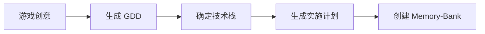

# Memory-Bank 生成工作流

> **文档类型**：工作流指南  
> **适用范围**：AI 驱动的项目开发  
> **最后更新**：2025-12-25

---

## 概述

Memory-Bank 是 Vibe Coding 方法论的核心组件，它是一个结构化的上下文目录，用于：

1. **固化项目上下文**：让 AI 始终理解项目全貌
2. **驱动分步实施**：按 Component 粒度拆分任务
3. **追踪开发进度**：记录已完成工作和架构演变
4. **确保一致性**：AI 每次执行前都读取相同的规范

---

## Memory-Bank 标准结构

```
your-project/
├── memory-bank/
│   ├── @game-design-document.md   # 游戏/产品设计文档
│   ├── @tech-stack.md             # 技术栈和约束
│   ├── @implementation-plan.md    # 实施计划（分步指令）
│   ├── @architecture.md           # 架构说明（文件职责）
│   └── @progress.md               # 进度追踪
│
├── CLAUDE.md                      # Claude Code 规则（Always）
├── AGENTS.md                      # Codex/其他 Agent 规则
└── (项目代码...)
```

**文件命名约定**：使用 `@` 前缀表示 memory-bank 核心文件，便于 AI 识别和引用。

---

## 工作流阶段

### 阶段 1：准备（规划先行）



#### 1.1 生成游戏设计文档

**提示词模板**：

```
我正在开发一个 [游戏类型] 游戏，核心玩法是 [一句话描述]。

请帮我生成一份简洁的游戏设计文档（GDD），包含：
1. 项目概要（游戏类型、核心体验、目标玩家）
2. 核心循环（用图示和文字说明）
3. 系统设计概要（列出主要系统）
4. MVP 范围定义（必须有/暂不做）

格式：Markdown
风格：简洁实用，避免过度设计
```

#### 1.2 确定技术栈

**提示词模板**：

```
基于这份游戏设计文档，请推荐最合适的技术栈。

要求：
- 最简单但最健壮的方案
- 列出每个技术选择的理由
- 标注任何重要约束或限制
- 说明架构模式（如 ECS、MVC 等）

我的平台是：[UEFN / Unity / Web / ...]
```

#### 1.3 生成实施计划

**提示词模板**：

```
基于以下文档：
- 游戏设计文档：[粘贴或引用]
- 技术栈：[粘贴或引用]

请生成一份详细的实施计划，要求：

1. 按 Component/模块粒度拆分任务
2. 每个任务在充足上下文下 AI 可一次完成
3. 每个任务必须包含验证方法
4. **严禁包含代码**——只写清晰指令
5. 标注任务间的依赖关系
6. 先聚焦 MVP，后续功能另开文档

输出格式：参考模板中的 @implementation-plan.md
```

### 阶段 2：澄清（确保清晰）

在开始实施前，让 AI 完全理解计划：

**提示词**：

```
阅读 /memory-bank 里所有文档。

请回答：
1. implementation-plan.md 是否完全清晰？
2. 你有哪些问题需要我澄清？
3. 哪些步骤的验证方法不够具体？

列出所有疑问，我会逐一回答。
```

AI 通常会问 5-10 个问题。回答后让它更新 `@implementation-plan.md`。

### 阶段 3：执行（逐步实施）

#### 第一个任务

**提示词模板**：

```
阅读 /memory-bank 所有文档，然后执行实施计划的 Step 1。

规则：
1. 我会负责跑测试，在我验证通过前不要开始下一步
2. 完成后更新 @progress.md 记录做了什么
3. 更新 @architecture.md 说明新增文件的职责
4. 如果遇到阻塞，停下来询问而不是猜测

先用 Plan Mode 说明你的实施方案，我确认后再执行。
```

#### 后续任务

**提示词模板**：

```
阅读 /memory-bank 所有文件。
阅读 @progress.md 了解之前的工作进度。

继续执行实施计划的 Step N。

规则同上：
1. 验证通过前不开始下一步
2. 完成后更新 @progress.md 和 @architecture.md
3. 遇到问题先问
```

### 阶段 4：迭代（持续改进）

MVP 完成后，新功能使用独立的 `feature-*.md` 文件：

```
memory-bank/
├── @implementation-plan.md      # MVP 计划
├── feature-fishing-system.md    # 功能：钓鱼系统
├── feature-theme-islands.md     # 功能：主题岛
└── ...
```

---

## 核心原则

### 1. 规划先行，AI 不自主规划

> "规划就是一切。谨慎让 AI 自主规划，否则你的代码库会变成一团无法管理的乱麻。"

Memory-Bank 的核心价值是**人类控制规划，AI 执行实施**。

### 2. 小步前进，频繁验证

每个 Step 应该：
- 产出可验证的结果
- 在 1-2 小时内完成
- 对应 1 个或少数几个相关 Component
- 有明确的"完成"定义

### 3. 文档即上下文，不是事后补

Memory-Bank 中的文档是 AI 的"工作记忆"：
- `@architecture.md` 随代码同步更新
- `@progress.md` 每步完成后立即记录
- 文档过时 = 上下文污染 = 垃圾输出

### 4. Always 规则强制阅读

在 `CLAUDE.md` 或 `AGENTS.md` 中设置 Always 规则：

```markdown
# 重要提示（Always）：
# 写任何代码前必须完整阅读 memory-bank/@architecture.md
# 写任何代码前必须完整阅读 memory-bank/@game-design-document.md
# 每完成一个任务后，必须更新 memory-bank/@architecture.md 和 @progress.md
```

---

## 提示词速查

### 生成 GDD

```
为我的 [游戏类型] 游戏生成 GDD，核心玩法：[描述]
```

### 生成技术栈

```
基于 GDD 推荐最简单健壮的技术栈，平台：[平台]
```

### 生成实施计划

```
基于 GDD + 技术栈，按 Component 粒度生成实施计划，严禁包含代码
```

### 澄清计划

```
阅读 memory-bank 所有文档，列出所有疑问
```

### 执行任务

```
阅读 memory-bank，执行 Step N，完成后更新 progress 和 architecture
```

### 继续开发

```
阅读 memory-bank 和 progress.md，继续 Step N
```

---

## 参考资料

- [Memory-Bank 通用模板](../../../documents/Templates%20and%20Resources/memory-bank-templates/)
- [本游戏的 Memory-Bank 实例](../memory-bank/)
- [Vibe Coding 方法论](../../../../README.md)
