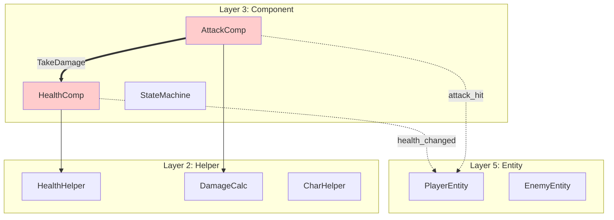
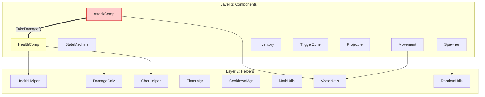
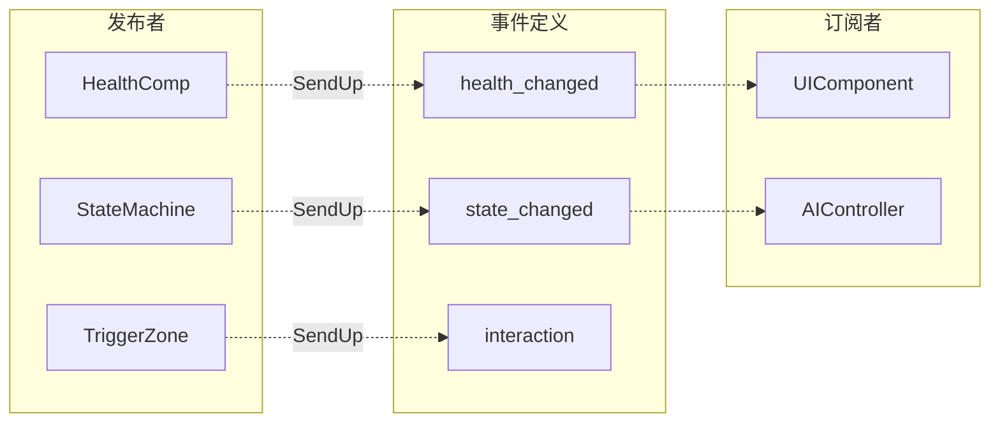
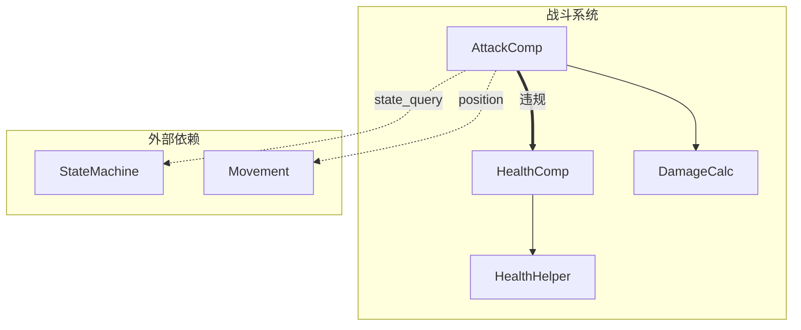

# 全局架构审计清单

> 用于 verse-code-auditor 的全局视角架构审计  
> 在逐文件检查之前执行，构建全貌后再深入细节

---

## 审计流程概览

```
第一阶段: 依赖图构建
    ↓
第二阶段: 违规热点识别
    ↓
第三阶段: 逐文件细粒度检查
```

---

## 第一阶段：依赖图构建

### 1.1 扫描目标

```
扫描范围: shared/code-library/
    ├── Components/*.verse
    ├── Helpers/*.verse
    ├── Events/*.verse
    └── Entities/*.verse
```

### 1.2 提取依赖关系

对每个文件提取：

| 提取项 | 模式 | 示例 |
|--------|------|------|
| 类/模块定义 | `xxx := class/module` | `health_component := class` |
| 组件获取 | `.GetComponent<xxx>()` | `GetComponent<health_component>()` |
| 方法调用 | `Xxx.Method()` | `HealthComp.TakeDamage()` |
| 事件派发 | `SendUp/SendDown(xxx{})` | `SendUp(health_changed_event{})` |
| 事件监听 | `OnXxx(Event:xxx_event)` | `OnDamageReceived(Event:damage_event)` |

### 1.3 依赖图输出格式

使用 Mermaid flowchart，遵循 [Mermaid 图表规范](../standards/mermaid-diagram-spec.md)。

#### 简化节点命名

| 全名 | 简称 | 节点ID |
|------|------|--------|
| `health_component` | HC | `HC[HealthComp]` |
| `attack_component` | AC | `AC[AttackComp]` |
| `state_machine_component` | SMC | `SMC[StateMachine]` |
| `HealthHelper` | HH | `HH[HealthHelper]` |
| `DamageCalculator` | DC | `DC[DamageCalc]` |

#### 分层布局



#### 边类型定义

| 边样式 | 语法 | 含义 |
|--------|------|------|
| `-->` | 实线箭头 | 正常依赖（调用 Helper） |
| `-.->` | 虚线箭头 | 事件派发（正确通信） |
| `==>` | 粗线箭头 | 🔴 违规直接调用 |
| `--x` | 带 x 终点 | 禁止的依赖方向 |

---

## 第二阶段：违规热点识别

### 2.1 违规类型统计表

```markdown
## 违规热点统计

| 检查项 | 违规数 | 涉及文件 | 阻断级 |
|--------|--------|----------|--------|
| ARC-006 组件直接调用 | 1 | AttackComponent.verse | 🔴 |
| ARC-008 Helper有状态 | 0 | - | 🔴 |
| ARC-009 Component内置工具 | 1 | HealthComponent.verse (v1) | ⚠️ |
| ARC-010 方法复杂度过高 | 2 | AttackComponent.verse, MovementComponent.verse | ⚠️ |

**总计**: 🔴阻断级 1 个，⚠️警告级 3 个
```

### 2.2 调用热点图

识别被多次违规调用的组件：

```markdown
## 被违规调用热点

| 目标组件 | 被调用次数 | 调用来源 |
|----------|------------|----------|
| HealthComponent | 1 | AttackComponent |
| StateComponent | 0 | - |

## 发起违规调用热点

| 来源组件 | 违规调用次数 | 调用目标 |
|----------|--------------|----------|
| AttackComponent | 1 | HealthComponent |
```

### 2.3 阻断判定

```
如果 🔴阻断级违规 > 0:
    ↓
    输出: "检测到 {N} 个阻断级架构违规"
    ↓
    展示违规热点图
    ↓
    必须修复后才能继续
```

---

## 第三阶段：逐文件细粒度检查

### 3.1 检查顺序

按依赖图的拓扑排序，从底层开始：

```
1. Helpers/*.verse (L2) - 最先检查，无依赖
2. Events/*.verse (L4) - 事件定义
3. Components/*.verse (L3) - 依赖 Helper
4. Entities/*.verse (L5) - 依赖 Component
```

### 3.2 每个文件的检查输出

```markdown
### 文件: Components/AttackComponent.verse

**类型**: Component (L3)
**依赖**: DamageCalculator (L2), HealthComponent (L3) ⚠️

#### 检查结果

| 检查项 | 结果 | 详情 |
|--------|------|------|
| ARC-001 分层依赖 | ✅ | - |
| ARC-002 API封装 | ✅ | 通过 CharacterHelper 调用 |
| ARC-003 事件流向 | ✅ | 正确使用 SendUp |
| ARC-006 组件直接调用 | 🔴 | 直接调用 HealthComponent.TakeDamage() |
| ARC-010 方法复杂度 | ⚠️ | TryAttack() 超过 20 行 |

#### 违规代码

```verse
# 行 45-47
if (TargetHealth := Target.GetComponent<health_component>()):
    TargetHealth.TakeDamage(FinalDamage)  # 🔴 ARC-006
```

#### 修复建议

```verse
# 改用事件派发
Target.SendUp(damage_received_event{
    Amount := FinalDamage,
    Source := option{GetOwner()}
})
```
```

---

## 完整审计报告模板

基于 `shared/code-library/` 的实际审计输出：

```markdown
# 全局架构审计报告

**审计时间**: 2025-12-28 10:30
**审计目标**: shared/code-library/
**审计深度**: deep (全局扫描 + 逐文件检查)

---

## 一、依赖图总览

### 1.1 组件层依赖图



### 1.2 事件流图



---

## 二、违规热点统计

| 检查项 | 违规数 | 阻断级 | 涉及文件 |
|--------|--------|--------|----------|
| ARC-006 组件直接调用 | 1 | 🔴 | AttackComponent.verse:45 |
| ARC-008 Helper有状态 | 0 | 🔴 | - |
| ARC-009 Component工具函数 | 1 | ⚠️ | HealthComponent.verse (v1):12-14 |
| ARC-010 方法复杂度 | 1 | ⚠️ | AttackComponent.verse:30-55 |

**审计结论**: 🔴 阻断 - 存在 1 个阻断级违规

---

## 三、逐文件详细报告

### 3.1 AttackComponent.verse

**文件路径**: `Components/AttackComponent.verse`
**类型**: Component (L3)
**依赖分析**:
- ✅ DamageCalculator (L2)
- ✅ VectorUtils (L2)
- 🔴 HealthComponent (L3) - 违规依赖

| 检查项 | 结果 |
|--------|------|
| ARC-001 | ✅ |
| ARC-002 | ✅ |
| ARC-003 | ✅ |
| ARC-006 | 🔴 直接调用 HealthComponent.TakeDamage() |
| ARC-010 | ⚠️ TryAttack() 方法 25 行 |

**违规代码** (行 45-47):
```verse
if (TargetHealth := Target.GetComponent<health_component>()):
    TargetHealth.TakeDamage(FinalDamage)
```

**修复方案**:
```verse
Target.SendUp(damage_received_event{
    Amount := FinalDamage,
    Attacker := option{GetOwner()},
    DamageType := AttackType
})
```

---

### 3.2 HealthComponent.verse (v1)

**文件路径**: `Components/HealthComponent.verse`
**类型**: Component (L3)
**状态**: ⚠️ 建议使用 v2 版本

| 检查项 | 结果 |
|--------|------|
| ARC-001 | ✅ |
| ARC-002 | ✅ |
| ARC-009 | ⚠️ 包含 Max/Min/Clamp 工具函数 |

**问题代码** (行 12-14):
```verse
Max<private>(A:int, B:int):int = if A > B then A else B
Min<private>(A:int, B:int):int = if A < B then A else B
Clamp<private>(V:int, Lo:int, Hi:int):int = Max(Lo, Min(Hi, V))
```

**建议**: 移至 `MathUtils.verse` 或使用 v2 版本

---

### 3.3 HealthComponent.v2.verse ✅

**文件路径**: `Components/HealthComponent.v2.verse`
**类型**: Component (L3)
**状态**: ✅ 符合架构规范

| 检查项 | 结果 |
|--------|------|
| ARC-001 ~ ARC-010 | ✅ 全部通过 |

**亮点**:
- 正确委托计算给 HealthHelper
- 清晰的状态/事件分离
- 完整的生命周期管理

---

## 四、修复优先级

| 优先级 | 文件 | 问题 | 工作量 |
|--------|------|------|--------|
| P0 | AttackComponent.verse | ARC-006 组件直接调用 | 中 |
| P1 | HealthComponent.verse | 标记 deprecated | 低 |
| P2 | AttackComponent.verse | ARC-010 方法拆分 | 中 |

---

## 五、下一步行动

1. **必须**: 修复 AttackComponent 的组件直接调用 (ARC-006)
2. **建议**: 在 HealthComponent.verse 添加 `@deprecated` 注释
3. **可选**: 拆分 AttackComponent.TryAttack() 方法

---

*审计完成时间: 2025-12-28 10:45*
```

---

## 复杂度控制

### 大型代码库处理

当文件数量 > 30 时，依赖图按功能域拆分：

```markdown
## 子图索引

| 子图 | 包含组件 | 节点数 |
|------|----------|--------|
| 战斗系统 | Attack, Health, Damage | 8 |
| 移动系统 | Movement, Pathfinding | 5 |
| 状态系统 | State, AI | 6 |
| UI系统 | UI, HUD | 4 |
```

每个子图独立绘制，节点数控制在 ≤15。

### 子图示例



---

## 版本历史

| 版本 | 日期 | 变更 |
|------|------|------|
| 1.0.0 | 2025-12-28 | 初始版本 - 三阶段审计流程 |

---

*最后更新: 2025-12-28*
