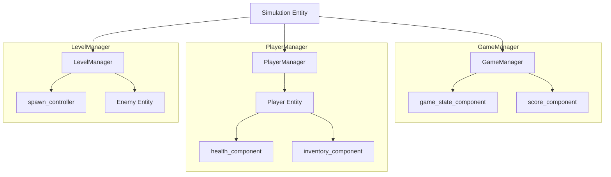
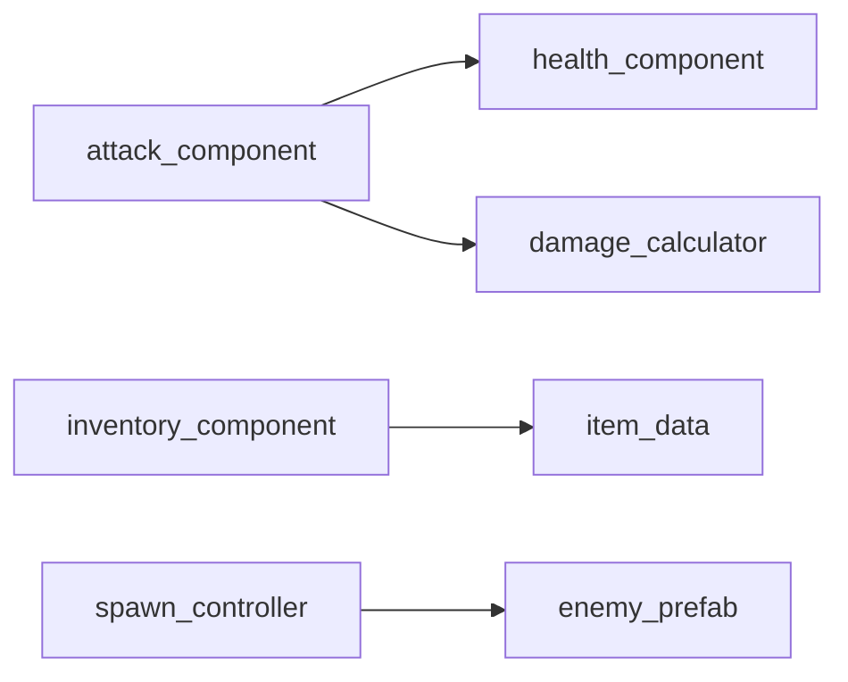

# 架构设计大纲

> 此文件由 verse-framework-designer 生成和维护

---

## 项目信息

- **项目名**: [项目名称]
- **创建时间**: [timestamp]
- **状态**: [设计中/已确认/需修改]
- **版本**: v1.0

---

## 1. Entity树结构

### 1.1 层级图



### 1.2 Entity清单

| Entity | 父Entity | 类型 | 说明 |
|--------|----------|------|------|
| GameManager | Root | 静态 | 游戏状态管理 |
| PlayerManager | Root | 静态 | 玩家管理 |
| Player | PlayerManager | 动态 | 玩家实体 |
| LevelManager | Root | 静态 | 关卡管理 |
| Enemy | LevelManager | 动态 | 敌人实体 |

---

## 2. Component清单

### 2.1 管理类组件

| 组件 | 所属Entity | 职责 | 依赖 |
|------|-----------|------|------|
| game_state_component | GameManager | 游戏状态机 | - |
| score_component | GameManager | 分数管理 | - |
| spawn_controller | LevelManager | 敌人生成 | - |

### 2.2 角色类组件

| 组件 | 所属Entity | 职责 | 依赖 |
|------|-----------|------|------|
| health_component | Player/Enemy | 生命值 | - |
| inventory_component | Player | 背包 | item_data |
| movement_component | Player/Enemy | 移动 | - |
| attack_component | Player/Enemy | 攻击 | health_component(目标) |

### 2.3 系统类组件

| 组件 | 所属Entity | 职责 | 依赖 |
|------|-----------|------|------|
| [组件名] | [Entity] | [职责] | [依赖] |

---

## 3. 事件设计

### 3.1 事件定义

```verse
# 玩家相关
player_damaged_event := class<concrete>(scene_event):
    var Player:agent
    var Damage:int
    var Source:?entity

player_died_event := class<concrete>(scene_event):
    var Player:agent

# 敌人相关
enemy_spawned_event := class<concrete>(scene_event):
    var Enemy:entity
    var SpawnPoint:vector3

enemy_killed_event := class<concrete>(scene_event):
    var Enemy:entity
    var Killer:agent
    var ScoreValue:int

# 游戏状态
game_state_changed_event := class<concrete>(scene_event):
    var OldState:game_state
    var NewState:game_state
```

### 3.2 事件流向

| 事件 | 发送方式 | 发送者 | 接收者 |
|------|----------|--------|--------|
| player_damaged_event | SendUp | Player | GameManager |
| enemy_killed_event | SendUp | Enemy | GameManager, LevelManager |
| game_state_changed_event | SendDown | GameManager | All |

### 3.3 事件流图

```
[Player受伤]
    ↓ health_component.TakeDamage()
    ↓ SendUp(player_damaged_event)
GameManager
    ├── score_component: 忽略
    └── game_state_component: 检查游戏结束
        ↓ [如果结束]
        ↓ SendDown(game_over_event)
All Entities: 执行清理
```

---

## 4. 依赖关系

### 4.1 组件依赖图



### 4.2 初始化顺序

```
1. GameManager 初始化
   └── game_state_component
   └── score_component

2. PlayerManager 初始化
   └── 等待玩家加入

3. LevelManager 初始化
   └── spawn_controller
```

---

## 5. 扩展点

### 5.1 预留接口

| 扩展点 | 扩展方式 | 说明 |
|--------|----------|------|
| 新敌人类型 | 继承 enemy_entity | 添加特殊组件 |
| 新武器类型 | 扩展 attack_component | 新攻击逻辑 |
| 新游戏模式 | 扩展状态机 | 新状态和转换 |

### 5.2 配置化设计

| 配置项 | 类型 | 默认值 | 说明 |
|--------|------|--------|------|
| MaxPlayers | int | 4 | 最大玩家数 |
| InitialHealth | int | 100 | 初始生命值 |
| EnemySpawnInterval | float | 5.0 | 生成间隔 |

---

## 6. 设计决策

### 6.1 决策记录

| 决策 | 选择 | 原因 |
|------|------|------|
| Entity vs 纯组件 | 混合使用 | 管理器用Entity类，动态对象用纯组件 |
| 事件粒度 | 细粒度 | 便于选择性处理 |
| 数据存储 | weak_map | 玩家数据推荐方式 |

### 6.2 待确认项

- [ ] [待确认项1]
- [ ] [待确认项2]

---

## 7. 检查结果

### 架构检查清单

- [x] 单一职责: 每个组件只负责一个功能
- [x] 松耦合: 组件通过事件通信
- [x] 事件流完整性: 所有事件有明确路径
- [x] 扩展点预留: 已预留扩展接口
- [ ] 命名一致性: [需要调整的项]
- [x] 生命周期覆盖: 所有组件有生命周期处理

---

*架构版本: 1.0*
*最后更新: [timestamp]*
