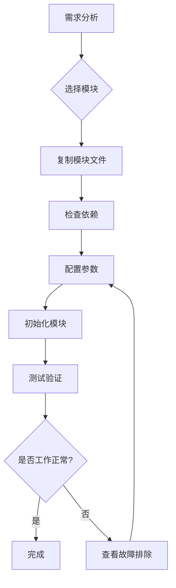
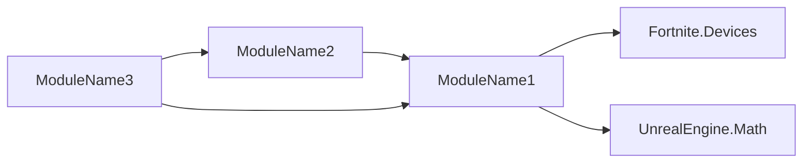

# ==========================================

# SKILL.md 模板 - 组装指南版本

# ==========================================

# 说明: 更新后的 SKILL.md 定位为"模块索引 + 组装指南"

# 位置: skills/[category]/[skillName]/SKILL.md

# ==========================================

---

name: skillName
description: 技能简短描述
version: 1.0.0
layer: X  # 仅适用于分层技能
---

# Skill Name（技能名称）

> **类型**: [类型描述，如：Layer 4 - 事件流层]  
> **职责**: [核心职责描述]  
> **期刊状态**:  

---

## 📚 本期刊简介

本期刊（模块库）专注于 [领域描述]，提供可直接组装使用的 [模块类型] 模块。

**核心理念**: **研究 → 验证 → 生产模块 → 项目直接组装（胶水开发）**

---

## 🚀 快速开始

### 1. 确定需求

**我需要什么？**

- [ ] [需求描述 1] → 推荐模块：[ModuleName1]
- [ ] [需求描述 2] → 推荐模块：[ModuleName2]
- [ ] [需求描述 3] → 推荐模块：[ModuleName3]

### 2. 选择套餐

| 套餐 | 包含模块 | 适用场景 |
|------|---------|----------|
| **最小配置** | [Module1] | 小型项目、原型开发 |
| **标准配置** | [Module1, Module2] | 中型项目、完整游戏模式 |
| **完整配置** | [Module1, Module2, Module3] | 大型项目、多模式游戏 |

### 3. 组装模块

参考 [模块组装工作流](#模块组装工作流) 进行集成。

---

## 📦 模块目录

### 核心模块 (Core) ⭐⭐⭐

| 模块名称 | 版本 | 状态 | 描述 | 文档 |
|---------|------|------|------|------|
| [ModuleName1](modules/ModuleName1/) | v1.0.0 | 🟢 stable | 模块简短描述 | [README](modules/ModuleName1/README.md) |
| [ModuleName2](modules/ModuleName2/) | v1.0.0 | 🟢 stable | 模块简短描述 | [README](modules/ModuleName2/README.md) |

### 高级模块 (Advanced) ⭐⭐

| 模块名称 | 版本 | 状态 | 描述 | 文档 |
|---------|------|------|------|------|
| [ModuleName3](modules/ModuleName3/) | v0.9.0 | 🟡 beta | 模块简短描述 | [README](modules/ModuleName3/README.md) |

### 实验模块 (Experimental) ⭐

| 模块名称 | 版本 | 状态 | 描述 | 文档 |
|---------|------|------|------|------|
| [ModuleName4](modules/ModuleName4/) | v0.5.0 | 🔴 experimental | 模块简短描述 | [README](modules/ModuleName4/README.md) |

**状态说明**:

- 🟢 **stable**: 稳定版本，API 不会破坏性变更
- 🟡 **beta**: 测试版本，API 相对稳定
- 🔴 **experimental**: 实验版本，API 可能变动

---

## 🎯 预设套餐

### 最小配置 (Minimal)

```yaml
modules:
  - ModuleName1  # 核心功能

use_cases:
  - 小型游戏
  - 原型开发
```

### 标准配置 (Standard)

```yaml
modules:
  - ModuleName1  # 核心功能
  - ModuleName2  # 增强功能

use_cases:
  - 中型游戏
  - 完整游戏模式
```

### 完整配置 (Complete)

```yaml
modules:
  - ModuleName1  # 核心功能
  - ModuleName2  # 增强功能
  - ModuleName3  # 高级功能

use_cases:
  - 大型游戏
  - 多模式游戏
```

---

## 🔧 模块组装工作流



### 详细步骤

#### 步骤 1: 复制模块文件

```bash
# 从期刊复制模块到项目
cp -r skills/[category]/skillName/modules/ModuleName/ YourProject/Scripts/
```

#### 步骤 2: 检查依赖

查看模块的 `MODULE.yaml` 文件，确保所有依赖项已满足：

```yaml
dependencies:
  verse_modules:
    - Fortnite.Devices
    - UnrealEngine.Math
  internal_modules:
    - BaseModule  # 需要先复制此模块
```

#### 步骤 3: 配置参数

根据项目需求调整模块配置：

```verse
var Config:module_config = module_config{
    Setting1 := 100,
    Setting2 := true
}
```

#### 步骤 4: 初始化模块

在适当的生命周期钩子中初始化模块：

```verse
OnBeginSimulation<override>()<suspends>:void =
    Sleep(0.0)  # 重要：延迟一帧
    InitializeModule(Config)
```

#### 步骤 5: 测试验证

运行项目并验证模块功能是否正常。

---

## 📊 模块依赖图



**依赖说明**:

- ModuleName1 是基础模块，依赖 Verse 核心库
- ModuleName2 和 ModuleName3 依赖 ModuleName1

---

## 🔍 故障排除

### 常见问题

#### 问题 1: 编译错误 - 找不到符号

**症状**: `Symbol 'ModuleName' not found`

**原因**: 模块未正确导入或依赖缺失

**解决方案**:

```verse
# 添加 using 语句
using { /YourProject/ModuleName }
```

#### 问题 2: 运行时错误 - 初始化失败

**症状**: 模块功能不工作

**原因**: 未在 OnBeginSimulation 中初始化

**解决方案**:

```verse
OnBeginSimulation<override>()<suspends>:void =
    Sleep(0.0)  # 必须延迟一帧！
    # 初始化代码
```

#### 问题 3: 性能问题

**症状**: 游戏卡顿

**原因**: 模块配置不当或使用不当

**解决方案**: 查看模块的 MODULE.yaml 中的性能优化建议

---

## 📖 研究记录索引

本期刊的研究记录位于 [`research/`](research/) 目录：

| 编号 | 标题 | 日期 | 相关模块 |
|------|------|------|----------|
| [PAPER-001](research/paper-001.md) | 研究论文标题 1 | 2026-01-04 | ModuleName1 |
| [PAPER-002](research/paper-002.md) | 研究论文标题 2 | 2026-01-04 | ModuleName2, ModuleName3 |

---

## 🚧 待研究问题

待研究的问题位于 [`drafts/`](drafts/) 目录：

| 编号 | 标题 | 优先级 | 状态 |
|------|------|--------|------|
| [DRAFT-001](drafts/draft-001.md) | 问题标题 1 | 高 | 研究中 |
| [DRAFT-002](drafts/draft-002.md) | 问题标题 2 | 中 | 待开始 |

---

## 💡 最佳实践

### 1. 模块选择原则

- ✅ 优先使用 **stable** 状态的核心模块
- ✅ 按需选择 **beta** 状态的高级模块
- ⚠️ 谨慎使用 **experimental** 状态的实验模块
- ❌ 避免使用 **deprecated** 状态的废弃模块

### 2. 模块组合原则

- 先添加核心模块，再添加高级模块
- 注意检查模块间的依赖关系
- 避免功能重复的模块同时使用

### 3. 性能优化建议

- 只使用需要的模块，避免引入不必要的代码
- 注意模块的性能影响（查看 MODULE.yaml 中的 performance 字段）
- 大型项目建议使用模块的精简版本（如果提供）

---

## 🔗 相关资源

### 期刊资源

- [JOURNAL.yaml](JOURNAL.yaml) - 期刊元数据
- [modules/_INDEX.yaml](modules/_INDEX.yaml) - 模块索引
- [modules/](modules/) - 模块库
- [research/](research/) - 研究记录
- [drafts/](drafts/) - 待研究问题

### 外部资源

- [UEFN 官方文档](https://dev.epicgames.com/documentation/en-us/uefn)
- [Verse 语言参考](https://dev.epicgames.com/documentation/en-us/uefn/verse-language-reference)

---

## 📝 贡献指南

欢迎贡献新的模块或改进现有模块！

### 投稿类型

1. **研究记录** (Research Paper): 放入 `research/`
2. **可复用模块** (Module): 放入 `modules/`
3. **待研究问题** (Draft): 放入 `drafts/`

### 投稿标准

- 模块必须包含完整的 `MODULE.yaml` 元数据
- 代码必须包含详细注释
- 必须包含使用示例
- 必须通过验证测试

详细信息请参考 [JOURNAL.yaml](JOURNAL.yaml) 中的 `submission` 章节。

---

## 📊 期刊统计

| 统计项 | 数量 |
|--------|------|
| 📄 研究论文 | 0 |
| 📦 模块总数 | 0 |
| 🟢 核心模块 | 0 |
| 🟡 高级模块 | 0 |
| 🔴 实验模块 | 0 |

---

## 📞 联系方式

如有问题或建议，请通过以下方式联系：

- GitHub Issues: [创建 Issue](../../issues/new)
- 讨论区: [GitHub Discussions](../../discussions)

---

*最后更新: 2026-01-04*  
*期刊版本: 1.0.0*  
*模板版本: 1.0.0*
