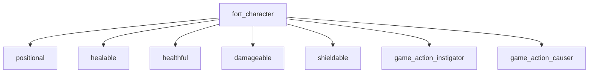

# Fortnite.com/Characters API 模块参考文档

## 1. 模块概述

### 1.1 模块用途

`/Fortnite.com/Characters` 模块是 UEFN/Verse 开发中用于**操作和管理 Fortnite 角色**的核心 API 模块。它提供了一个统一的接口 `fort_character`，用于访问角色的状态、行为、生命值、护盾、物理属性等。

### 1.2 设计理念

该模块采用**接口组合（Interface Composition）**的设计模式：

- **多重接口继承**：`fort_character` 继承了 7 个基础接口，每个接口负责一类特定功能
- **统一抽象层**：无论是玩家角色、AI 角色还是 NPC，都通过同一个 `fort_character` 接口访问
- **事件驱动架构**：提供多个 `listenable` 事件，支持响应式编程模式
- **失败优先设计**：大部分方法使用 `<decides>` 修饰符，遵循 Verse 的显式失败处理机制

### 1.3 适用场景

| 场景分类 | 典型应用 |
|---------|---------|
| **角色状态查询** | 检测角色是否在空中、水中、蹲伏、滑翔等运动状态 |
| **生命值管理** | 获取/设置角色生命值、最大生命值、护盾值 |
| **角色控制** | 传送角色、控制可见性、设置无敌状态、施加物理力 |
| **事件响应** | 监听角色淘汰、跳跃、蹲伏、冲刺等事件 |
| **交互系统** | 获取角色的 agent/entity 引用，与其他 API 模块协作 |

### 1.4 模块依赖

```verse
using {/Verse.org/SpatialMath}
using {/Verse.org/SceneGraph}
using {/UnrealEngine.com/Temporary/SpatialMath}
using {/Verse.org/Simulation}
using {/Fortnite.com/Game}
```

## 2. 核心类/接口清单

### 2.1 主接口

#### fort_character

**完整签名**：

```verse
fort_character<native><public> := interface<unique><epic_internal>(
    positional,                  # 位置/变换信息
    healable,                    # 可治疗接口
    healthful,                   # 生命值管理
    damageable,                  # 可伤害接口
    shieldable,                  # 护盾系统
    game_action_instigator,      # 游戏动作发起者
    game_action_causer           # 游戏动作原因
)
```

**接口继承关系**：



### 2.2 辅助结构体

#### stasis_args

用于控制角色进入静止状态时的行为限制。

```verse
stasis_args<native><public> := struct:
    AllowTurning<native><public>:logic    # 允许转向
    AllowFalling<native><public>:logic    # 允许下落
    AllowEmotes<native><public>:logic     # 允许表情动作
```

### 2.3 扩展方法（Extension Methods）

| 方法签名 | 功能 | 来源类型 |
|---------|------|---------|
| `(InAgent:agent).GetFortCharacter()<transacts><decides>:fort_character` | 从 agent 获取 fort_character | agent |
| `(InAgent:agent).GetInstigator()<transacts>:game_action_instigator` | 获取 agent 的 instigator 接口 | agent |
| `(InInstigator:game_action_instigator).GetInstigatorAgent()<transacts><decides>:agent` | 从 instigator 获取 agent | game_action_instigator |

### 2.4 继承的接口（来自 Fortnite.com/Game）

| 接口名 | 功能域 | 关键方法 |
|-------|-------|---------|
| **positional** | 位置信息 | `GetTransform()` |
| **healthful** | 生命值系统 | `GetHealth()`, `SetHealth()`, `GetMaxHealth()`, `SetMaxHealth()` |
| **shieldable** | 护盾系统 | `GetShield()`, `SetShield()`, `GetMaxShield()`, `SetMaxShield()` |
| **damageable** | 伤害系统 | `Damage(Amount:float)`, `Damage(Args:damage_args)`, `DamagedEvent()` |
| **healable** | 治疗系统 | `Heal(Amount:float)`, `Heal(Args:healing_args)`, `HealedEvent()` |

## 3. 关键 API 详解

### 3.1 核心身份转换方法

#### GetAgent

```verse
GetAgent<public>()<transacts><decides>:agent
```

**功能**：返回与此 `fort_character` 关联的 `agent` 对象。

**使用场景**：当需要与其他需要 `agent` 类型的 API 交互时（如团队系统、玩家工具等）。

**返回值**：`agent` 类型，失败时触发 `<decides>` 失败分支。

**注意事项**：

- 使用 `<decides>` 修饰符，必须处理失败情况
- 通常不会失败，除非 `fort_character` 已无效

#### GetEntity

```verse
GetEntity<public>()<transacts><decides>:entity
```

**功能**：返回与此 `fort_character` 关联的 `entity` 对象。

**使用场景**：与 SceneGraph 系统交互、获取组件引用时。

**返回值**：`entity` 类型，失败时触发失败分支。

### 3.2 状态查询方法（Decides 系列）

所有以 `Is` 开头的方法都使用 `<decides>` 修饰符，成功表示条件为真，失败表示条件为假。

#### IsActive

```verse
IsActive<public>()<transacts><decides>:void
```

**功能**：检查角色是否在世界中且未被淘汰。

**重要性**：⭐⭐⭐⭐⭐ **最重要的前置检查**

**失败场景**：

- 角色已被淘汰
- 角色已从世界中移除
- 角色对象已无效

**最佳实践**：

```verse
# ✅ 正确：在操作角色前检查是否活跃
if (Character.IsActive[]):
    Character.SetHealth(100.0)
else:
    Print("角色已不在游戏中")

# ❌ 错误：不检查就直接操作（操作会静默失败）
Character.SetHealth(100.0)  # 如果角色无效，不会抛错但也不会生效
```

#### 运动状态查询

| 方法 | 功能 | 典型用途 |
|------|------|---------|
| `IsOnGround()` | 角色是否在地面上 | 落地检测、跳跃逻辑 |
| `IsInAir()` | 角色是否在空中 | 空中攻击、二段跳判断 |
| `IsInWater()` | 角色是否在水中 | 水下机制、溺水检测 |
| `IsFalling()` | 角色是否在下落 | 摔落伤害计算 |
| `IsGliding()` | 角色是否在滑翔 | 滑翔相关玩法 |
| `IsFlying()` | 角色是否在飞行 | 飞行模式检测 |
| `IsCrouching()` | 角色是否蹲伏 | 潜行系统 |

#### IsDownButNotOut

```verse
IsDownButNotOut<public>()<transacts><decides>:void
```

**功能**：检查角色是否处于"倒地待救"状态。

**使用场景**：团队模式中的复活机制、倒地计时器。

#### IsVulnerable

```verse
IsVulnerable<public>()<transacts><decides>:void
```

**功能**：检查角色是否可被伤害。

**配套方法**：`SetVulnerability(Vulnerable:logic)`

### 3.3 视角和位置方法

#### GetViewRotation

```verse
GetViewRotation<public>()<transacts>:rotation
```

**功能**：返回角色当前瞄准/视角朝向的旋转值。

**返回值**：`rotation` 类型（来自 `/UnrealEngine.com/Temporary/SpatialMath`）

**使用场景**：

- 射击方向计算
- 视线检测
- AI 视野判断

#### GetViewLocation

```verse
GetViewLocation<public>()<transacts>:vector3
```

**功能**：返回角色视角的起始位置（眼睛位置）。

**使用场景**：

- 射线投射起点
- 第一人称视角计算

#### GetTransform (继承自 positional)

```verse
GetTransform<public>()<transacts>:transform
```

**功能**：返回角色的完整变换信息（位置 + 旋转 + 缩放）。

### 3.4 控制方法

#### TeleportTo

```verse
TeleportTo<public>(
    Position:vector3, 
    Rotation:rotation
)<transacts><decides>:void
```

**功能**：将角色传送到指定位置和旋转。

**参数**：

- `Position`：目标位置（世界坐标系）
- `Rotation`：目标旋转（应用 Yaw 和 Pitch）

**失败场景**：

- 目标位置在玩家空间外
- 目标位置无法容纳角色（碰撞检测）
- 目标位置在无效区域

**最佳实践**：

```verse
if (Character.TeleportTo[SpawnPoint, DefaultRotation]):
    Print("传送成功")
else:
    Print("传送失败：位置无效")
```

#### Show / Hide

```verse
Show<public>():void
Hide<public>():void
```

**功能**：控制角色可见性。

**注意事项**：

- `Hide()` 只影响视觉渲染，不影响碰撞
- 隐藏的角色仍然可以被伤害（除非设置 `SetVulnerability(false)`）

#### SetVulnerability

```verse
SetVulnerability<public>(Vulnerable:logic)<transacts>:void
```

**功能**：设置角色是否可被伤害。

**参数**：

- `Vulnerable = true`：可被伤害（默认）
- `Vulnerable = false`：无敌状态

**典型用途**：

- 出生保护期
- 过场动画期间
- Boss 无敌阶段

### 3.5 静止控制（Stasis）

#### PutInStasis

```verse
PutInStasis<public>(Args:stasis_args)<transacts>:void
```

**功能**：将角色置于静止状态，限制某些动作。

**参数示例**：

```verse
StasisConfig := stasis_args:
    AllowTurning := true      # 允许转向但不能移动
    AllowFalling := false     # 禁止下落（悬浮效果）
    AllowEmotes := true       # 允许表情动作

Character.PutInStasis(StasisConfig)
```

**应用场景**：

- 剧情对话时冻结玩家移动
- Boss 战开场演出
- 观战模式

#### ReleaseFromStasis

```verse
ReleaseFromStasis<public>()<transacts>:void
```

**功能**：解除静止状态，恢复正常控制。

### 3.6 物理方法

#### GetLinearVelocity

```verse
GetLinearVelocity<public>()<reads>:vector3
```

**功能**：获取角色线性速度（米/秒）。

**返回值**：`vector3` 类型，单位为 m/s。

#### SetLinearVelocity

```verse
SetLinearVelocity<public>(LinearVelocity:vector3):void
```

**功能**：直接设置角色速度。

**限制**：物理禁用时不生效。

#### ApplyLinearImpulse

```verse
ApplyLinearImpulse<public>(LinearImpulse:vector3):void
```

**功能**：施加线性冲量（牛顿·秒）。

**使用场景**：

- 爆炸击退效果
- 弹射装置
- 技能击飞

**物理公式**：`Impulse = Mass × Velocity`

#### ApplyForce

```verse
ApplyForce<public>(Force:vector3):void
```

**功能**：持续施加力（牛顿）。

**区别**：

- `ApplyForce`：持续作用力，每帧都需调用
- `ApplyLinearImpulse`：瞬时冲量，调用一次即可

#### GetMass

```verse
GetMass<public>()<reads>:float
```

**功能**：获取角色质量（千克）。

**用途**：物理计算、力的换算。

### 3.7 事件系统

#### EliminatedEvent

```verse
EliminatedEvent<public>():listenable(elimination_result)
```

**功能**：角色被淘汰时触发。

**事件数据**：

```verse
elimination_result := struct:
    EliminatedCharacter:fort_character        # 被淘汰者
    EliminatingCharacter:?fort_character      # 淘汰者（环境伤害时为 false）
```

**示例**：

```verse
Character.EliminatedEvent().Subscribe(OnCharacterEliminated)

OnCharacterEliminated(Result:elimination_result):void=
    if (Killer := Result.EliminatingCharacter?):
        Print("击杀者：{Killer}")
    else:
        Print("环境淘汰")
```

#### JumpedEvent

```verse
JumpedEvent<public>():listenable(fort_character)
```

**功能**：角色跳跃时触发。

**事件载荷**：跳跃的 `fort_character` 本身。

#### CrouchedEvent

```verse
CrouchedEvent<public>():listenable(tuple(fort_character, logic))
```

**功能**：蹲伏状态改变时触发。

**事件载荷**：

- `[0]`：角色对象
- `[1]`：`true` = 蹲下，`false` = 站起

#### SprintedEvent

```verse
SprintedEvent<public>():listenable(tuple(fort_character, logic))
```

**功能**：冲刺状态改变时触发。

**事件载荷**：

- `[0]`：角色对象
- `[1]`：`true` = 开始冲刺，`false` = 停止冲刺

### 3.8 生命值和护盾（继承自 Game 模块）

#### 生命值方法

```verse
# healthful 接口
GetHealth()<transacts>:float
SetHealth(Health:float)<transacts>:void
GetMaxHealth()<transacts>:float
SetMaxHealth(MaxHealth:float)<transacts>:void
```

**限制**：

- 生命值范围：`[1.0, MaxHealth]`（不能直接设为 0）
- 最大生命值范围：`[1.0, Inf]`
- 修改 MaxHealth 会按比例缩放当前生命值

#### 护盾方法

```verse
# shieldable 接口
GetShield()<transacts>:float
SetShield(Shield:float)<transacts>:void
GetMaxShield()<transacts>:float
SetMaxShield(MaxShield:float)<transacts>:void
DamagedShieldEvent():listenable(damage_result)
HealedShieldEvent():listenable(healing_result)
```

**护盾机制**：

- 护盾先于生命值承受伤害
- 护盾范围：`[0.0, MaxShield]`
- 最大护盾范围：`[0.0, Inf]`

#### 伤害方法

```verse
# damageable 接口
Damage(Amount:float):void                 # 匿名伤害
Damage(Args:damage_args):void             # 带来源的伤害
DamagedEvent():listenable(damage_result)
```

**damage_args 结构**：

```verse
damage_args := struct:
    Instigator:?game_action_instigator    # 伤害发起者
    Source:?game_action_causer            # 伤害来源
    Amount:float                          # 伤害量
```

#### 治疗方法

```verse
# healable 接口
Heal(Amount:float):void                   # 匿名治疗
Heal(Args:healing_args):void              # 带来源的治疗
HealedEvent():listenable(healing_result)
```

## 4. 代码示例

### 示例 1：角色生命值监控系统

```verse
using {/Fortnite.com/Characters}
using {/Fortnite.com/Game}
using {/Verse.org/Simulation}

# 监控所有玩家的生命值变化
health_monitor_device := class(creative_device):
    
    OnBegin<override>()<suspends>:void=
        AllPlayers := GetPlayspace().GetPlayers()
        for (Player : AllPlayers):
            if (Agent := agent[Player], FortCharacter := Agent.GetFortCharacter[]):
                # 订阅伤害和治疗事件
                FortCharacter.DamagedEvent().Subscribe(OnCharacterDamaged)
                FortCharacter.HealedEvent().Subscribe(OnCharacterHealed)
    
    OnCharacterDamaged(Result:damage_result):void=
        if (Character := fort_character[Result.Target]):
            CurrentHealth := Character.GetHealth()
            MaxHealth := Character.GetMaxHealth()
            HealthPercent := CurrentHealth / MaxHealth * 100.0
            
            Print("伤害：{Result.Amount}，剩余生命值：{HealthPercent}%")
            
            # 低血量警告
            if (HealthPercent < 25.0):
                Print("⚠️ 生命值危险！")
    
    OnCharacterHealed(Result:healing_result):void=
        Print("治疗：+{Result.Amount}")
```

### 示例 2：角色传送系统（带失败处理）

```verse
using {/Fortnite.com/Characters}
using {/UnrealEngine.com/Temporary/SpatialMath}
using {/Verse.org/Simulation}

teleport_system := class(creative_device):
    
    @editable
    TeleportPoints:[]vector3 = array{}
    
    # 安全传送：检查角色状态 + 重试机制
    SafeTeleport(Character:fort_character, TargetIndex:int):void=
        # 1. 检查角色是否有效
        if (not Character.IsActive[]):
            Print("传送失败：角色已无效")
            return
        
        # 2. 检查索引合法性
        if (TargetIndex < 0 or TargetIndex >= TeleportPoints.Length):
            Print("传送失败：无效的传送点索引")
            return
        
        TargetPos := TeleportPoints[TargetIndex]
        DefaultRotation := MakeRotationFromYawPitchRoll(0.0, 0.0, 0.0)
        
        # 3. 尝试传送
        if (Character.TeleportTo[TargetPos, DefaultRotation]):
            Print("✅ 传送成功")
        else:
            # 4. 失败后尝试备用位置（高度上移 100cm）
            BackupPos := vector3:
                X := TargetPos.X
                Y := TargetPos.Y
                Z := TargetPos.Z + 100.0
            
            if (Character.TeleportTo[BackupPos, DefaultRotation]):
                Print("⚠️ 使用备用位置传送")
            else:
                Print("❌ 传送彻底失败")
```

### 示例 3：角色运动状态机

```verse
using {/Fortnite.com/Characters}
using {/Verse.org/Simulation}

movement_state<public> := enum:
    Ground
    Air
    Water
    Gliding

character_movement_tracker := class(creative_device):
    
    var<private> CurrentState:movement_state = movement_state.Ground
    
    TrackCharacterMovement(Character:fort_character)<suspends>:void=
        loop:
            NewState := DetectMovementState(Character)
            
            # 状态切换时触发事件
            if (NewState <> CurrentState):
                OnMovementStateChanged(Character, CurrentState, NewState)
                set CurrentState = NewState
            
            Sleep(0.1)  # 每 0.1 秒检测一次
    
    DetectMovementState(Character:fort_character):movement_state=
        if (Character.IsInWater[]):
            movement_state.Water
        else if (Character.IsGliding[]):
            movement_state.Gliding
        else if (Character.IsInAir[]):
            movement_state.Air
        else:
            movement_state.Ground
    
    OnMovementStateChanged(
        Character:fort_character, 
        OldState:movement_state, 
        NewState:movement_state
    ):void=
        Print("运动状态切换：{OldState} -> {NewState}")
        
        # 根据状态切换触发不同逻辑
        if (NewState = movement_state.Air, OldState = movement_state.Ground):
            Print("角色跳起")
        else if (NewState = movement_state.Ground, OldState = movement_state.Air):
            Print("角色落地")
```

### 示例 4：物理击退系统

```verse
using {/Fortnite.com/Characters}
using {/Verse.org/SpatialMath}

knockback_device := class(creative_device):
    
    @editable
    KnockbackForce:float = 1000.0  # 击退力度（牛顿）
    
    # 向指定方向击退角色
    ApplyKnockback(Character:fort_character, Direction:vector3):void=
        if (not Character.IsActive[]):
            return
        
        # 归一化方向并缩放到指定力度
        NormalizedDir := Normalize(Direction)
        Mass := Character.GetMass()
        
        # 计算冲量（牛顿·秒）
        # 假设作用时间 0.1 秒
        ImpulseDuration := 0.1
        Impulse := vector3:
            X := NormalizedDir.X * KnockbackForce * ImpulseDuration
            Y := NormalizedDir.Y * KnockbackForce * ImpulseDuration
            Z := NormalizedDir.Z * KnockbackForce * ImpulseDuration
        
        # 施加冲量
        Character.ApplyLinearImpulse(Impulse)
        Print("击退：力度 {KnockbackForce}N，质量 {Mass}kg")
    
    # 爆炸击退：将附近角色向外推
    ExplosionKnockback(ExplosionCenter:vector3, Radius:float):void=
        AllPlayers := GetPlayspace().GetPlayers()
        
        for (Player : AllPlayers):
            if (Agent := agent[Player], Character := Agent.GetFortCharacter[]):
                CharPos := Character.GetTransform().Translation
                
                # 计算距离
                ToChar := vector3:
                    X := CharPos.X - ExplosionCenter.X
                    Y := CharPos.Y - ExplosionCenter.Y
                    Z := CharPos.Z - ExplosionCenter.Z
                
                Distance := Length(ToChar)
                
                # 范围内才击退
                if (Distance <= Radius):
                    # 距离越近力度越大
                    ForceFactor := 1.0 - (Distance / Radius)
                    ApplyKnockback(Character, ToChar)
```

### 示例 5：角色无敌护盾系统

```verse
using {/Fortnite.com/Characters}
using {/Verse.org/Simulation}
using {/Verse.org/Concurrency}

invincibility_manager := class(creative_device):
    
    # 给角色添加限时无敌
    GrantInvincibility(Character:fort_character, Duration:float)<suspends>:void=
        if (not Character.IsActive[]):
            return
        
        # 1. 设置无敌
        Character.SetVulnerability(false)
        Print("🛡️ 无敌已激活")
        
        # 2. 视觉反馈：隐藏-显示闪烁效果
        race:
            block:
                BlinkEffect(Character)
            block:
                Sleep(Duration)
        
        # 3. 恢复可伤害
        Character.SetVulnerability(true)
        Character.Show()  # 确保最后是可见状态
        Print("🛡️ 无敌已结束")
    
    # 闪烁效果
    BlinkEffect(Character:fort_character)<suspends>:void=
        loop:
            Character.Hide()
            Sleep(0.1)
            Character.Show()
            Sleep(0.1)
    
    # 护盾充能系统
    ShieldRechargeSystem(Character:fort_character)<suspends>:void=
        loop:
            if (Character.IsActive[]):
                CurrentShield := Character.GetShield()
                MaxShield := Character.GetMaxShield()
                
                # 如果护盾未满，每秒恢复 5 点
                if (CurrentShield < MaxShield):
                    NewShield := Min(CurrentShield + 5.0, MaxShield)
                    Character.SetShield(NewShield)
            
            Sleep(1.0)
```

## 5. 常见误区澄清

### 误区 1：认为 `fort_character` 是一个类

**错误理解**：`fort_character` 是一个可以实例化的类。

**正确理解**：`fort_character` 是一个**接口（interface）**，不能直接创建实例。它由 Fortnite 引擎内部创建，开发者只能通过 `agent.GetFortCharacter()` 获取。

```verse
# ❌ 错误：尝试创建 fort_character 实例
MyChar := fort_character{}  # 编译错误！

# ✅ 正确：从 agent 获取
if (Agent := agent[Player], Character := Agent.GetFortCharacter[]):
    # 使用 Character
```

### 误区 2：以为 `SetHealth(0.0)` 可以淘汰角色

**错误理解**：通过 `SetHealth(0.0)` 直接将角色生命值设为 0 可以淘汰角色。

**正确理解**：`SetHealth()` 会将生命值**钳制到 [1.0, MaxHealth] 范围**，无法设为 0。必须使用 `Damage()` 方法来淘汰角色。

```verse
# ❌ 错误：尝试设置生命值为 0（会被钳制为 1.0）
Character.SetHealth(0.0)  # 实际生命值 = 1.0

# ✅ 正确：使用伤害方法淘汰
Character.Damage(999999.0)  # 施加大量伤害
```

### 误区 3：混淆 `Hide()` 和 `SetVulnerability(false)`

**错误理解**：`Hide()` 会让角色完全无法被攻击。

**正确理解**：`Hide()` 只是**视觉隐藏**，不影响碰撞和伤害判定。要实现无敌，需要同时使用两者。

```verse
# ❌ 错误：只隐藏外观（仍可被攻击）
Character.Hide()

# ✅ 正确：同时设置无敌
Character.Hide()
Character.SetVulnerability(false)
```

### 误区 4：忽略 `IsActive()` 检查

**错误理解**：所有 `fort_character` 方法在角色无效时会抛出错误。

**正确理解**：大部分方法会**静默失败**。如果不检查 `IsActive()`，代码看起来正常运行，但实际没有效果。

```verse
# ❌ 危险：角色可能已被淘汰，操作静默失败
Character.SetHealth(100.0)
Character.TeleportTo(Pos, Rot)

# ✅ 安全：先检查再操作
if (Character.IsActive[]):
    Character.SetHealth(100.0)
    Character.TeleportTo(Pos, Rot)
else:
    Print("角色已无效，无法操作")
```

### 误区 5：误解物理方法的生效条件

**错误理解**：`ApplyLinearImpulse()` 和 `SetLinearVelocity()` 对所有角色都生效。

**正确理解**：这些方法**仅在物理启用时生效**。Fortnite 角色默认使用角色运动控制器，物理方法可能不生效或效果有限。

```verse
# ⚠️ 注意：以下方法可能不生效（取决于角色物理状态）
Character.SetLinearVelocity(HighSpeed)
Character.ApplyForce(PushForce)

# ✅ 可靠的运动控制：使用 TeleportTo 或 AI 导航系统
```

### 误区 6：混淆 `agent` 和 `fort_character`

**错误理解**：`agent` 和 `fort_character` 是同一个东西。

**正确理解**：

- **agent**：Verse 的通用代理类型，代表游戏中的任何代理对象（玩家、NPC、观众等）
- **fort_character**：Fortnite 特定的角色接口，只有具备角色实体的 agent 才有

```verse
# ❌ 错误：直接将 agent 当作 fort_character 使用
SomeAgent.GetHealth()  # 编译错误：agent 没有 GetHealth 方法

# ✅ 正确：先转换为 fort_character
if (Character := SomeAgent.GetFortCharacter[]):
    Health := Character.GetHealth()
```

### 误区 7：不理解 `<decides>` 的用法

**错误理解**：带 `<decides>` 的方法返回 `logic` 类型（true/false）。

**正确理解**：`<decides>` 方法使用**失败/成功机制**，需要用 `if` 或 `?` 运算符处理。

```verse
# ❌ 错误：尝试将 <decides> 方法当作布尔值
IsOnGround := Character.IsOnGround()  # 编译错误！

# ✅ 正确：使用失败敏感上下文
if (Character.IsOnGround[]):
    Print("在地面上")
else:
    Print("不在地面上")
```

## 6. 最佳实践

### 6.1 始终检查 `IsActive()`

在对角色进行任何操作前，先检查其是否有效：

```verse
# 推荐模式：早期返回
ProcessCharacter(Character:fort_character):void=
    if (not Character.IsActive[]):
        return
    
    # 安全操作区域
    Character.SetHealth(100.0)
    Character.TeleportTo(SpawnPoint, DefaultRotation)
```

### 6.2 使用事件订阅时管理生命周期

事件订阅会持续存在，确保在适当时机取消订阅：

```verse
var CharacterSubscription:?cancelable = false

OnBegin<override>()<suspends>:void=
    if (Character := GetPlayerCharacter[]):
        # 保存 cancelable 引用
        set CharacterSubscription = option:
            Character.EliminatedEvent().Subscribe(OnEliminated)

OnEnd<override>()<suspends>:void=
    # 取消订阅
    if (Sub := CharacterSubscription?):
        Sub.Cancel()
```

### 6.3 伤害系统最佳实践

优先使用带参数的 `Damage()` 方法，以便追踪伤害来源：

```verse
# ✅ 推荐：带完整参数
DamageArgs := damage_args:
    Instigator := option{AttackerAgent.GetInstigator()}
    Source := option{game_action_causer[Weapon]}
    Amount := 50.0

Character.Damage(DamageArgs)

# ⚠️ 不推荐：匿名伤害（无法追踪来源）
Character.Damage(50.0)
```

### 6.4 状态查询优化

将频繁查询的状态缓存，避免每帧调用：

```verse
# ❌ 低效：每次循环都查询
loop:
    if (Character.IsActive[] and Character.IsOnGround[]):
        # 处理逻辑
    Sleep(0.0)

# ✅ 高效：状态改变时才更新
var IsGrounded:logic = false

loop:
    NewGroundState := Character.IsOnGround[]
    if (NewGroundState <> IsGrounded):
        set IsGrounded = NewGroundState
        OnGroundStateChanged(IsGrounded)
    Sleep(0.1)
```

### 6.5 物理操作注意事项

使用物理方法时，考虑角色质量的影响：

```verse
# 推荐：根据质量计算冲量
Mass := Character.GetMass()
DesiredVelocity := 10.0  # m/s

# 冲量 = 质量 × 速度变化
Impulse := vector3:
    X := UpDirection.X * DesiredVelocity * Mass
    Y := UpDirection.Y * DesiredVelocity * Mass
    Z := UpDirection.Z * DesiredVelocity * Mass

Character.ApplyLinearImpulse(Impulse)
```

### 6.6 与其他模块的协作

#### 与团队系统集成

```verse
using {/Fortnite.com/Characters}
using {/Fortnite.com/Teams}

GetCharacterTeam(Character:fort_character):?team=
    if (Agent := Character.GetAgent[]):
        return GetPlayspace().GetTeamCollection().GetTeam[Agent]
    return false
```

#### 与玩家工具集成

```verse
using {/Fortnite.com/Characters}
using {/Fortnite.com/FortPlayerUtilities}

RespawnCharacter(Character:fort_character):void=
    if (Agent := Character.GetAgent[]):
        Agent.Respawn(SpawnLocation, SpawnRotation)
```

#### 与 SceneGraph 集成

```verse
using {/Fortnite.com/Characters}
using {/Verse.org/SceneGraph}

AttachPropToCharacter(Character:fort_character, Prop:entity):void=
    if (CharEntity := Character.GetEntity[]):
        # 通过 entity 访问 SceneGraph 组件
        # 实现道具附着逻辑
```

### 6.7 性能建议

1. **批量操作**：对多个角色执行相同操作时，使用并发：

```verse
ProcessAllCharacters()<suspends>:void=
    AllPlayers := GetPlayspace().GetPlayers()
    
    # 并发处理所有角色
    for (Player : AllPlayers):
        spawn:
            ProcessSingleCharacter(Player)

ProcessSingleCharacter(Player:player)<suspends>:void=
    if (Agent := agent[Player], Character := Agent.GetFortCharacter[]):
        # 处理单个角色
```

1. **减少状态查询频率**：避免每帧调用 `<transacts>` 方法。

1. **事件优于轮询**：使用 `EliminatedEvent()` 而非每帧检查 `IsActive()`。

## 7. 参考资源

### 7.1 官方文档

- **UEFN 官方文档**: [Fortnite.com/Characters API](https://dev.epicgames.com/documentation/en-us/uefn/fortnite-com-characters-api)
- **Verse 语言参考**: [Verse Language Reference](https://dev.epicgames.com/documentation/en-us/uefn/verse-language-reference)

### 7.2 相关 API 模块

| 模块 | 关系 | 用途 |
|------|------|------|
| `/Fortnite.com/Game` | 提供基础接口 | `positional`, `healthful`, `damageable` 等接口定义 |
| `/Fortnite.com/FortPlayerUtilities` | 配套工具 | 玩家重生、观战等高级功能 |
| `/Fortnite.com/Teams` | 团队系统 | 获取角色所属团队 |
| `/Fortnite.com/AI` | AI 控制 | 将角色转换为 AI 控制 |
| `/Verse.org/Simulation` | 游戏循环 | `agent`, `player` 类型定义 |
| `/Verse.org/SceneGraph` | 场景管理 | `entity` 类型，组件系统 |

### 7.3 内部参考

- **API Digest 源文件**: `skills/programming/verseDev/shared/api-digests/Fortnite.digest.verse.md`（第 11769-11890 行）
- **模块列表**: `skills/programming/verseDev/shared/references/api-modules-list.md`
- **能力调研**: `skills/programming/verseDev/shared/references/api-modules-research.md`（第 204-214 行）

### 7.4 相关技术文档

- **Verse 失败机制**: `skills/programming/verseDev/shared/references/verse-failure-mechanisms.md`
- **Verse 类和对象**: `skills/programming/verseDev/shared/references/verse-classes-and-objects.md`
- **Verse 修饰符和属性**: `skills/programming/verseDev/shared/references/verse-specifiers-and-attributes.md`

---

## 附录：快速参考表

### A. 方法分类速查

| 分类 | 方法列表 |
|------|---------|
| **身份转换** | `GetAgent()`, `GetEntity()` |
| **状态查询** | `IsActive()`, `IsOnGround()`, `IsInAir()`, `IsInWater()`, `IsFalling()`, `IsGliding()`, `IsFlying()`, `IsCrouching()`, `IsDownButNotOut()`, `IsVulnerable()` |
| **位置视角** | `GetTransform()`, `GetViewRotation()`, `GetViewLocation()` |
| **生命护盾** | `GetHealth()`, `SetHealth()`, `GetMaxHealth()`, `SetMaxHealth()`, `GetShield()`, `SetShield()`, `GetMaxShield()`, `SetMaxShield()` |
| **伤害治疗** | `Damage()`, `Heal()`, `DamagedEvent()`, `HealedEvent()`, `DamagedShieldEvent()`, `HealedShieldEvent()` |
| **控制操作** | `TeleportTo()`, `Show()`, `Hide()`, `SetVulnerability()`, `PutInStasis()`, `ReleaseFromStasis()` |
| **物理** | `GetLinearVelocity()`, `SetLinearVelocity()`, `ApplyLinearImpulse()`, `ApplyForce()`, `GetMass()` |
| **事件** | `EliminatedEvent()`, `JumpedEvent()`, `CrouchedEvent()`, `SprintedEvent()` |

### B. 常用代码片段

#### 获取角色

```verse
if (Agent := agent[Player], Character := Agent.GetFortCharacter[]):
    # 使用 Character
```

#### 安全操作模式

```verse
if (Character.IsActive[]):
    # 操作代码
```

#### 事件订阅模板

```verse
Character.DamagedEvent().Subscribe(OnDamaged)

OnDamaged(Result:damage_result):void=
    # 处理伤害
```

#### 物理推动

```verse
Character.ApplyLinearImpulse(Direction * Force * Character.GetMass())
```

---

**文档版本**: 1.0
**生成日期**: 2026-01-04
**维护者**: UEFN/Verse 开发团队
