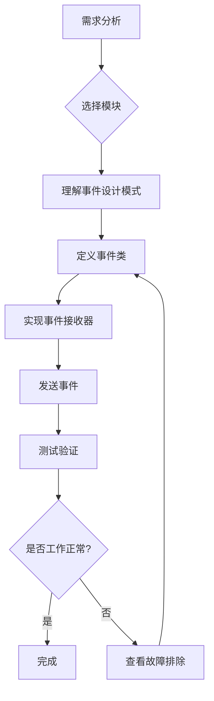
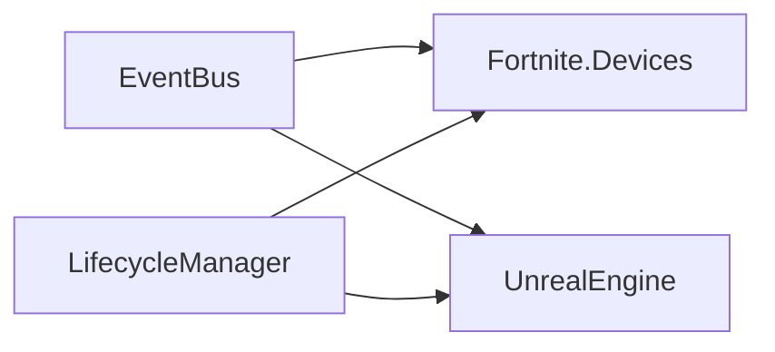

# Verse Event Flow（事件流模块库）

> **类型**: Layer 4 - 事件流层  
> **职责**: Scene Event 设计、事件传播策略、生命周期编排  
> **期刊状态**:  

---

## 📚 本期刊简介

本期刊（模块库）专注于 UEFN/Verse 事件系统设计，提供可直接组装使用的事件流模块。

**核心理念**: **研究 → 验证 → 生产模块 → 项目直接组装（胶水开发）**

---

## 🚀 快速开始

### 1. 确定需求

**我需要什么？**

- [ ] 组件间需要通信 → 推荐模块：[EventBus](modules/EventBus/)
- [ ] 需要控制初始化顺序 → 推荐模块：[LifecycleManager](modules/LifecycleManager/)
- [ ] 构建事件驱动架构 → 推荐套餐：[标准配置](#标准配置-standard)

### 2. 选择套餐

| 套餐 | 包含模块 | 适用场景 |
|------|---------|----------|
| **最小配置** | [EventBus](modules/EventBus/) | 小型项目、原型开发 |
| **标准配置** | [EventBus](modules/EventBus/), [LifecycleManager](modules/LifecycleManager/) | 中型项目、完整游戏模式 |
| **完整配置** | [EventBus](modules/EventBus/), [LifecycleManager](modules/LifecycleManager/) | 大型项目、多模式游戏 |

### 3. 组装模块

参考 [模块组装工作流](#模块组装工作流) 进行集成。

---

## 📦 模块目录

### 核心模块 (Core) ⭐⭐⭐

| 模块名称 | 版本 | 状态 | 描述 | 文档 |
|---------|------|------|------|------|
| [EventBus](modules/EventBus/) | v1.0.0 | 🟢 stable | 全局事件总线，提供发布/订阅机制 | [README](modules/EventBus/README.md) |
| [LifecycleManager](modules/LifecycleManager/) | v1.0.0 | 🟢 stable | 生命周期管理器，确保组件初始化顺序 | [README](modules/LifecycleManager/README.md) |

### 高级模块 (Advanced) ⭐⭐

*待添加 - 欢迎贡献！*

### 实验模块 (Experimental) ⭐

*待添加 - 欢迎贡献！*

**状态说明**:

- 🟢 **stable**: 稳定版本，API 不会破坏性变更
- 🟡 **beta**: 测试版本，API 相对稳定
- 🔴 **experimental**: 实验版本，API 可能变动

---

## 🎯 预设套餐

### 最小配置 (Minimal)

```yaml
modules:
  - EventBus  # 核心事件通信

use_cases:
  - 小型游戏（< 10 个组件）
  - 原型开发
  - 只需要基础事件通信
```

### 标准配置 (Standard)

```yaml
modules:
  - EventBus          # 核心事件通信
  - LifecycleManager  # 初始化顺序管理

use_cases:
  - 中型游戏（10-50 个组件）
  - 完整游戏模式
  - 需要管理初始化顺序
```

### 完整配置 (Complete)

```yaml
modules:
  - EventBus          # 核心事件通信
  - LifecycleManager  # 初始化顺序管理

use_cases:
  - 大型游戏（> 50 个组件）
  - 多模式游戏
  - 复杂事件驱动逻辑
```

---

## 🔧 模块组装工作流



### 详细步骤

#### 步骤 1: 理解事件设计模式

EventBus 基于 SceneGraph 的内置事件系统，无需复制额外文件。主要需要理解：

- Scene Event 的工作原理
- 三种传播策略（SendUp/SendDown/SendDirect）
- 事件消耗机制

参考：[EventBus README](modules/EventBus/README.md)

#### 步骤 2: 定义事件类

```verse
# 事件必须继承 scene_event 并使用 <concrete> 标记
player_scored_event := class<concrete>(scene_event):
    var Player:agent
    var Score:int
```

#### 步骤 3: 实现事件接收器

```verse
OnReceive<override>(Event:scene_event):logic =
    if (ScoreEvent := Event?player_scored_event):
        HandleScore(ScoreEvent)
        return true  # 消耗事件
    return false
```

#### 步骤 4: 发送事件

```verse
# 向父 Entity 发送（子向父报告）
Owner.SendUp(player_scored_event{Player := MyPlayer, Score := 100})

# 向子 Entity 广播（父向子广播）
Owner.SendDown(game_state_changed_event{NewState := Playing})

# 直接发送（点对点通信）
TargetEntity.SendDirect(custom_event{Data := "Hello"})
```

#### 步骤 5: 测试验证

运行项目并验证事件功能是否正常。

---

## 📊 模块依赖图



**依赖说明**:

- EventBus 和 LifecycleManager 相互独立
- 两者都依赖 Verse 核心库

---

## 🔍 故障排除

### 常见问题

#### 问题 1: 事件未收到

**症状**: `OnReceive` 没有被调用

**原因**: 传播策略选择错误或组件位置不对

**解决方案**:

```verse
# 检查传播策略
# 子→父: SendUp
# 父→子: SendDown
# 直接: SendDirect
```

参考：[EventBus 故障排除](modules/EventBus/README.md#故障排除)

#### 问题 2: 类型转换失败

**症状**: `Event?my_event` 总是返回 false

**原因**: 事件类缺少 `<concrete>` 标记

**解决方案**:

```verse
# ✅ 正确
player_event := class<concrete>(scene_event):
    var Player:agent

# ❌ 错误
player_event := class(scene_event):  # 缺少 <concrete>
    var Player:agent
```

#### 问题 3: 初始化顺序问题

**症状**: 组件B依赖组件A，但B先初始化

**解决方案**: 使用 LifecycleManager

参考：[LifecycleManager README](modules/LifecycleManager/README.md)

---

## 📖 研究记录索引

本期刊的研究记录位于 [`research/`](research/) 目录：

| 编号 | 标题 | 日期 | 相关模块 |
|------|------|------|----------|
| [PAPER-001](research/scenegraph-event-system.md) | SceneGraph 事件系统研究 | 2026-01-04 | EventBus, LifecycleManager |

---

## 🚧 待研究问题

待研究的问题位于 [`drafts/`](drafts/) 目录：

| 编号 | 标题 | 优先级 | 状态 |
|------|------|--------|------|
| OQ-001 | 事件优先级机制 | 中 | 研究中 |
| OQ-002 | 跨场景事件通信 | 低 | 待开始 |

---

## 💡 最佳实践

### 1. 模块选择原则

- ✅ 优先使用 **EventBus** 进行组件通信
- ✅ 在复杂系统中添加 **LifecycleManager** 管理初始化
- ✅ 从最小配置开始，按需添加功能

### 2. 事件设计原则

- 使用过去时命名事件（如 `player_damaged_event`）
- 事件类必须使用 `<concrete>` 标记
- 选择合适的传播策略（SendUp/SendDown/SendDirect）

### 3. 性能优化建议

- 避免在 `OnSimulate` 中频繁发送大量事件
- 使用事件消耗机制（return true）减少不必要的传播
- 初始化完成后停止不必要的检查

---

## 🔗 相关资源

### 期刊资源

- [JOURNAL.yaml](JOURNAL.yaml) - 期刊元数据
- [modules/_INDEX.yaml](modules/_INDEX.yaml) - 模块索引
- [modules/](modules/) - 模块库
- [research/](research/) - 研究记录
- [drafts/](drafts/) - 待研究问题

### 外部资源

- [UEFN 官方文档](https://dev.epicgames.com/documentation/en-us/uefn)
- [Verse 语言参考](https://dev.epicgames.com/documentation/en-us/uefn/verse-language-reference)
- [SceneGraph 框架指南](https://dev.epicgames.com/documentation/en-us/uefn/scenegraph-in-verse)

---

## 📝 贡献指南

欢迎贡献新的模块或改进现有模块！

### 投稿类型

1. **研究记录** (Research Paper): 放入 `research/`
2. **可复用模块** (Module): 放入 `modules/`
3. **待研究问题** (Draft): 放入 `drafts/`

### 投稿标准

- 事件类必须使用 `<concrete>` 标记
- 必须说明传播策略（SendUp/SendDown/SendDirect）
- 必须包含生命周期钩子使用示例
- 必须通过实际项目验证

详细信息请参考 [JOURNAL.yaml](JOURNAL.yaml) 中的 `submission` 章节。

---

## 📊 期刊统计

| 统计项 | 数量 |
|--------|------|
| 📄 研究论文 | 1 |
| 📦 模块总数 | 2 |
| 🟢 核心模块 | 2 |
| 🟡 高级模块 | 0 |
| 🔴 实验模块 | 0 |

---

## 📞 联系方式

如有问题或建议，请通过以下方式联系：

- GitHub Issues: [创建 Issue](https://github.com/TeamFlint-Dev/vibe-coding-cn/issues/new)
- 讨论区: [GitHub Discussions](https://github.com/TeamFlint-Dev/vibe-coding-cn/discussions)

---

*最后更新: 2026-01-04*  
*期刊版本: 1.0.0*  
*模板版本: 1.0.0*
