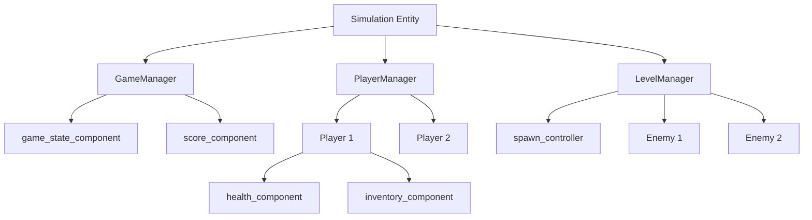
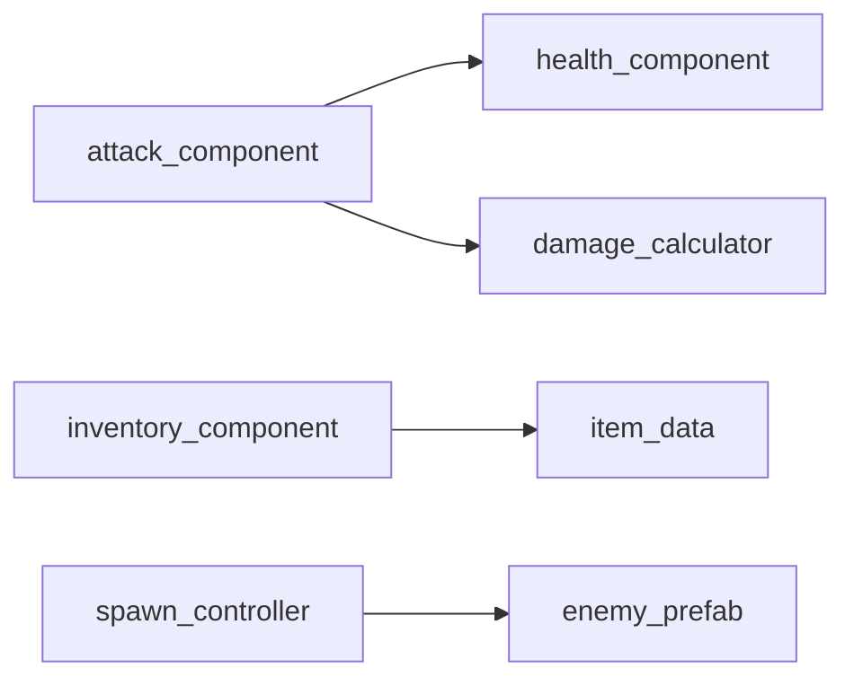

# Verse Framework Designer

> **类型**: Layer 5 - 框架设计层  
> **职责**: SceneGraph架构设计、Entity/Component规划、事件流设计、主动对话确认

---

## When to Use This Skill

当需要：
- 设计新游戏/功能的架构
- 规划 Entity 层级结构
- 确定 Component 组合方案
- 设计事件流向和通信模式

**触发条件**:
- 协调器进入架构设计模式
- 用户明确要求"设计架构"
- 新功能需要确定技术框架

---

## 核心职责

### 1. Entity树设计

确定游戏对象的层级结构：

```
Simulation Entity (根)
    │
    ├── GameManager Entity
    │   ├── game_state_component
    │   ├── score_component
    │   └── round_timer_component
    │
    ├── PlayerManager Entity
    │   └── [动态生成的 Player Entity]
    │       ├── health_component
    │       ├── inventory_component
    │       └── movement_component
    │
    └── LevelManager Entity
        ├── spawn_controller_component
        └── [动态生成的 Enemy Entity]
```

### 2. Component清单

列出所有需要的组件及其职责：

| 组件名 | 所属Entity | 职责 | 依赖 |
|--------|-----------|------|------|
| game_state_component | GameManager | 管理游戏状态 | - |
| health_component | Player/Enemy | 生命值管理 | - |
| attack_component | Player/Enemy | 攻击行为 | health_component |

### 3. 事件流图

设计系统间的通信方式：

```
player_damaged_event
    ↑ SendUp
Player Entity
    │
    ↓ SendDown (game_over_event)
GameManager Entity
    │
    ↓ SendDown
All Child Entities
```

### 4. 依赖关系

明确组件和系统间的依赖：

```
attack_component
    └── 依赖 → health_component (目标需要有此组件)
    └── 依赖 → damage_calculator (Helper函数)

inventory_component  
    └── 依赖 → item_data (数据结构)
    └── 触发 → item_added_event
```

---

## 主动对话机制

### 设计确认流程

框架设计层会主动与用户对话，确认关键决策：

```markdown
设计师: "根据你的需求，我设计了以下Entity结构：

[展示Entity树]

请确认：
1. GameManager 是否需要拆分为多个子管理器？
2. Player和Enemy是否共用相同的组件集？
3. 是否需要预留扩展点（如Boss类型）？"

用户: "Boss需要单独处理，预留扩展点"

设计师: "好的，我会添加：
- BossEnemy Entity (继承Enemy结构，增加boss_phase_component)
- boss_phase_changed_event
- 在Enemy基类预留 OnBossPhaseChange 钩子

继续确认事件流设计..."
```

### 确认检查点

| 检查点 | 确认内容 |
|--------|----------|
| Entity结构 | 层级是否合理、是否预留扩展 |
| Component分配 | 职责是否单一、是否有遗漏 |
| 事件流向 | 通信路径是否清晰、是否有循环依赖 |
| 依赖关系 | 是否有隐藏依赖、是否可测试 |

---

## 输出格式

### @architecture-blueprint.md

```markdown
# 架构设计大纲

> 项目: [项目名]
> 设计时间: 2025-12-27
> 状态: ✅ 已确认

---

## 1. Entity树结构



---

## 2. Component清单

### 2.1 管理类组件

| 组件 | Entity | 职责 | 生命周期要点 |
|------|--------|------|--------------|
| game_state_component | GameManager | 游戏状态管理 | OnBeginSimulation初始化状态机 |
| score_component | GameManager | 分数追踪 | 监听kill_event累加分数 |

### 2.2 角色类组件

| 组件 | Entity | 职责 | 生命周期要点 |
|------|--------|------|--------------|
| health_component | Player/Enemy | 生命值 | OnSimulate检查死亡 |
| attack_component | Player/Enemy | 攻击 | 需要target_finder支持 |

### 2.3 系统类组件

| 组件 | Entity | 职责 | 生命周期要点 |
|------|--------|------|--------------|
| spawn_controller | LevelManager | 敌人生成 | 定时器控制生成波次 |

---

## 3. 事件流图

### 3.1 事件定义

```verse
# 玩家相关事件
player_damaged_event := class<concrete>(scene_event):
    var Player:agent
    var Damage:int
    var Source:?entity

player_died_event := class<concrete>(scene_event):
    var Player:agent
    var Killer:?entity

# 敌人相关事件
enemy_spawned_event := class<concrete>(scene_event):
    var Enemy:entity
    var SpawnPoint:vector3

enemy_killed_event := class<concrete>(scene_event):
    var Enemy:entity
    var Killer:agent
    var ScoreValue:int
```

### 3.2 传播策略

| 事件 | 发送方式 | 发送者 | 接收者 |
|------|----------|--------|--------|
| player_damaged_event | SendUp | Player | GameManager |
| player_died_event | SendUp | Player | GameManager |
| enemy_spawned_event | SendDown | LevelManager | All Children |
| game_state_changed | SendDown | GameManager | All Entities |

### 3.3 事件流图

```
[Player受伤]
    ↓
health_component.TakeDamage()
    ↓
SendUp(player_damaged_event)
    ↓
GameManager 接收
    ├── score_component: 忽略
    └── game_state_component: 检查是否游戏结束
        ↓
    [如果游戏结束]
        ↓
    SendDown(game_over_event)
        ↓
    所有子Entity接收，执行清理
```

---

## 4. 依赖关系

### 4.1 组件依赖图



### 4.2 初始化顺序

```
1. GameManager 组件初始化
2. PlayerManager 组件初始化
3. LevelManager 组件初始化
4. 动态Entity在运行时按需创建
```

---

## 5. 扩展点

### 5.1 预留接口

| 扩展点 | 说明 | 扩展方式 |
|--------|------|----------|
| 新敌人类型 | 添加特殊敌人 | 继承enemy_entity，添加特殊组件 |
| 新武器类型 | 添加武器种类 | 扩展attack_component或新建子类 |
| 新游戏模式 | 添加PVP等模式 | 扩展game_state_component状态机 |

### 5.2 配置化设计

| 配置项 | 类型 | 说明 |
|--------|------|------|
| MaxPlayers | int | 最大玩家数 |
| EnemySpawnInterval | float | 敌人生成间隔 |
| InitialHealth | int | 初始生命值 |

---

## 6. 设计决策记录

### 决策1: 使用自定义Entity类 vs 纯组件

**选择**: 管理器使用自定义Entity类，动态对象使用纯组件

**原因**: 
- 管理器需要稳定的对外接口
- 动态对象需要灵活的组件组合

### 决策2: 事件粒度

**选择**: 细粒度事件（如player_damaged）而非粗粒度（如player_state_changed）

**原因**:
- 便于不同组件选择性处理
- 减少事件数据冗余
```

---

## 架构检查清单集成

完成设计后，自动使用 [architecture-review.md](../shared/checklists/architecture-review.md) 验证：

```markdown
## 架构检查结果

✅ 单一职责: 每个组件只负责一个功能
✅ 松耦合: 组件通过事件通信，无直接引用
✅ 事件流完整性: 所有事件有明确的发送者和接收者
✅ 扩展点预留: 已预留3个扩展点
⚠️ 命名一致性: attack_component 建议改为 combat_component 以保持风格统一
✅ 生命周期覆盖: 所有组件都有完整的生命周期处理
```

---

## 下沉请求

当框架设计层需要下层支持时，生成请求：

```markdown
## 下沉请求: FWREQ-001

**请求层级**: Layer 2 (操作层)
**请求内容**: 需要距离计算函数

**需求描述**:
attack_component 需要判断目标是否在攻击范围内

**期望接口**:
```verse
CalculateDistance(From:vector3, To:vector3):float
IsInRange(From:vector3, To:vector3, Range:float):logic
```

**上下文约束**:
- 需要高性能（每帧调用）
- 返回值精度要求不高，可以使用近似计算
```

---

## Quick Reference

### 设计步骤

1. 理解需求，识别核心游戏对象
2. 设计Entity层级结构
3. 分配Component到Entity
4. 设计事件和通信方式
5. 确认依赖关系
6. 预留扩展点
7. 使用检查清单验证
8. 输出架构大纲

### 架构原则

| 原则 | 说明 |
|------|------|
| **组件单一职责** | 一个组件只做一件事 |
| **事件解耦** | 组件间通过事件通信，不直接引用 |
| **Entity作为容器** | Entity组织组件，不实现逻辑 |
| **深度控制** | Entity层级不超过4层 |
| **可测试性** | 每个组件可独立测试 |

---

## Reference Files

- [scenegraph-framework-guide.md](../shared/references/scenegraph-framework-guide.md) - SceneGraph框架详解
- [scenegraph-api-reference.md](../shared/references/scenegraph-api-reference.md) - API参考
- [architecture-review.md](../shared/checklists/architecture-review.md) - 架构检查清单

---

*最后更新: 2025-12-27*
