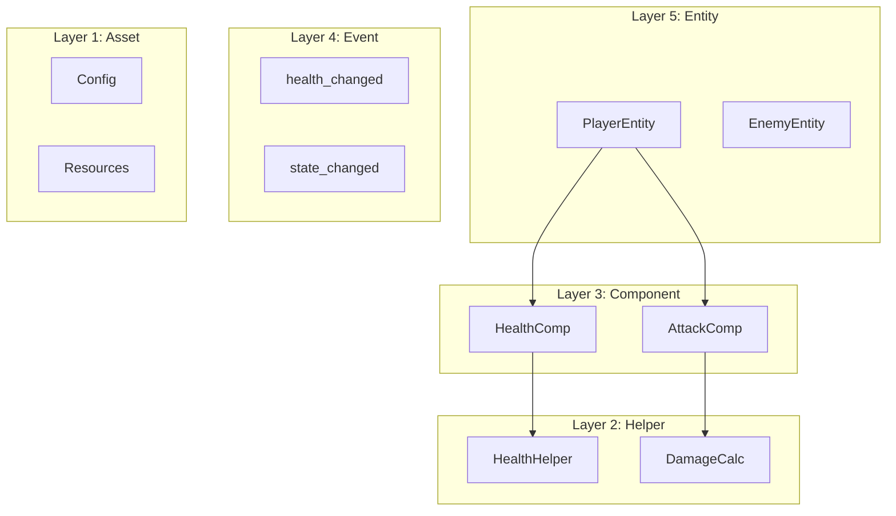
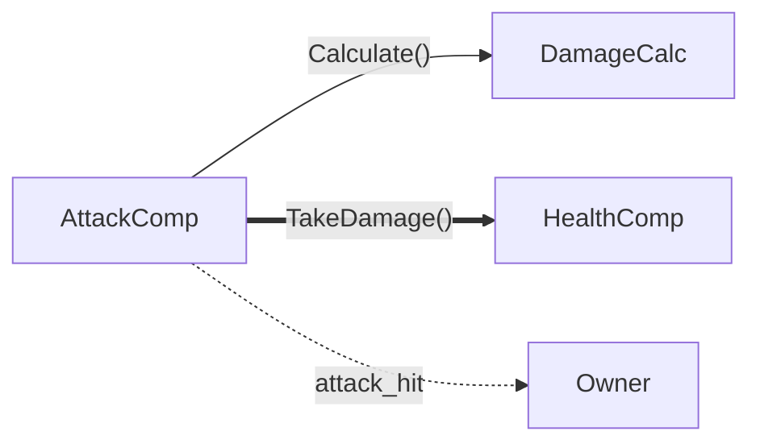
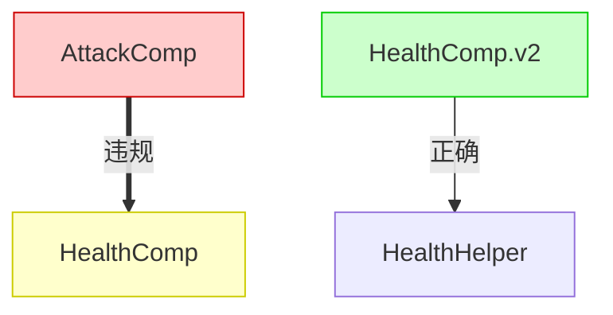
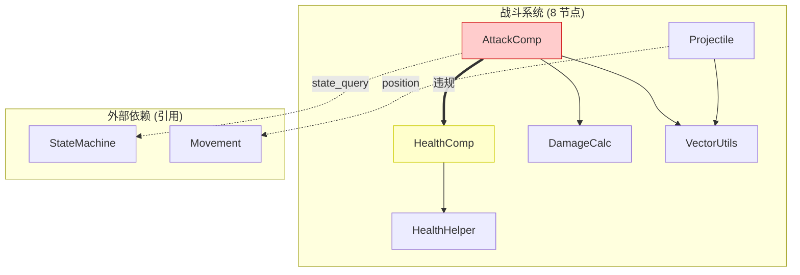
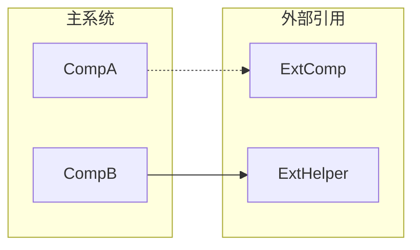
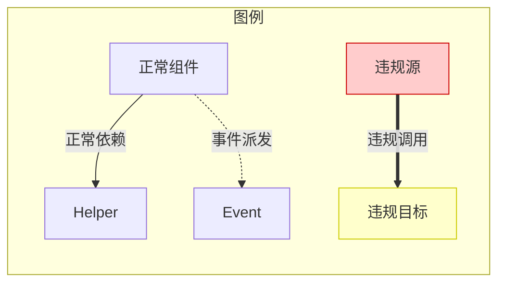
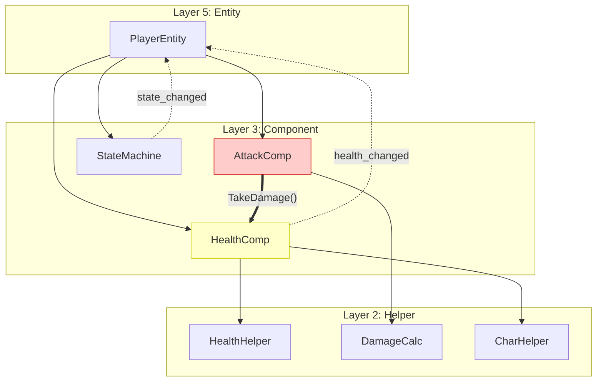

# Mermaid 图表绘制规范

> 确保依赖图在高复杂度时仍然可读  
> 适用于全局架构审计的依赖关系可视化

---

## 基本原则

1. **简洁优先**: 节点名称简短，边注释精炼
2. **分层清晰**: 遵循 L1-L5 架构分层
3. **颜色编码**: 快速识别正常/违规/警告
4. **复杂度控制**: 单图节点 ≤ 15，超出则拆分

---

## 节点命名规范

### 简称映射表

| 完整类名 | 简称 | 节点定义 |
|----------|------|----------|
| `health_component` | HC | `HC[HealthComp]` |
| `attack_component` | AC | `AC[AttackComp]` |
| `state_machine_component` | SMC | `SMC[StateMachine]` |
| `movement_component` | MC | `MC[Movement]` |
| `spawner_component` | SC | `SC[Spawner]` |
| `inventory_component` | IC | `IC[Inventory]` |
| `trigger_zone_component` | TZC | `TZC[TriggerZone]` |
| `projectile_component` | PC | `PC[Projectile]` |
| `HealthHelper` | HH | `HH[HealthHelper]` |
| `DamageCalculator` | DC | `DC[DamageCalc]` |
| `CharacterHelper` | CH | `CH[CharHelper]` |
| `MathUtils` | MU | `MU[MathUtils]` |
| `VectorUtils` | VU | `VU[VectorUtils]` |
| `RandomUtils` | RU | `RU[RandomUtils]` |
| `player_entity` | PE | `PE[PlayerEntity]` |
| `enemy_entity` | EE | `EE[EnemyEntity]` |

### 命名规则

1. **简称**: 2-4 个大写字母，取关键词首字母
2. **显示名**: 驼峰式，省略 `_component`/`_entity` 后缀
3. **节点ID**: 简称作为唯一标识符


---

## 分层布局规范

### 标准五层结构



### 子图命名

| 层级 | 子图名 | 示例 |
|------|--------|------|
| L5 | `Layer 5: Entity` | Entity 容器 |
| L4 | `Layer 4: Event` | 事件定义 |
| L3 | `Layer 3: Component` | 组件容器 |
| L2 | `Layer 2: Helper` | Helper 容器 |
| L1 | `Layer 1: Asset` | 资产引用 |

---

## 边样式规范

### 边类型定义

| 含义 | 语法 | 颜色 | 示例 |
|------|------|------|------|
| 正常依赖 | `-->` | 默认 | `HC --> HH` |
| 事件派发 | `-.->` | 蓝色 | `HC -.-> PE` |
| 🔴 违规调用 | `==>` | 红色 | `AC ==> HC` |
| 禁止依赖 | `--x` | 灰色 | `HH --x PE` |

### 边注释

简短描述调用内容：



注释规则：
- 方法调用: `"MethodName()"`
- 事件名: `"event_name"`
- 数据流: `"data_type"`

---

## 颜色编码规范

### 节点颜色

| 状态 | 填充色 | 边框色 | 用途 |
|------|--------|--------|------|
| 正常 | 默认 | 默认 | 符合规范的组件 |
| 🔴 违规源 | `#ffcccc` | `#cc0000` | 发起违规调用的组件 |
| 🟡 违规目标 | `#ffffcc` | `#cccc00` | 被违规调用的组件 |
| 🟢 示范 | `#ccffcc` | `#00cc00` | 符合最佳实践的组件 |
| ⚪ 已弃用 | `#e0e0e0` | `#999999` | deprecated 组件 |

### 应用示例



---

## 复杂度控制

### 阈值标准

| 指标 | 阈值 | 处理方式 |
|------|------|----------|
| 单图节点数 | ≤ 15 | 正常绘制 |
| 单图节点数 | 16-30 | 按功能域拆分 |
| 单图节点数 | > 30 | 分层级 + 按功能域拆分 |

### 功能域拆分

当组件数超过 15 时，按功能域拆分为多个子图：

```markdown
## 子图索引

| 子图名称 | 包含组件 | 节点数 |
|----------|----------|--------|
| 战斗系统 | Attack, Health, Damage, Projectile | 8 |
| 移动系统 | Movement, Pathfinding, Navigation | 5 |
| 状态系统 | StateMachine, AI, Behavior | 6 |
| 交互系统 | Trigger, Inventory, Pickup | 5 |
```

### 子图绘制示例



### 跨子图依赖表示

当子图之间有依赖时，使用 "外部依赖" 子图收集引用：



---

## 图例模板

每个依赖图应包含图例说明：



---

## 完整示例

### 小型项目 (≤15 节点)



### 大型项目 (分子图)

见 [global-architecture-audit.md](../checklists/global-architecture-audit.md) 中的完整审计报告模板。

---

## 工具建议

### 在线编辑器

- [Mermaid Live Editor](https://mermaid.live/) - 实时预览
- [VS Code Mermaid 插件](https://marketplace.visualstudio.com/items?itemName=bierner.markdown-mermaid) - 编辑器内预览

### 导出格式

| 格式 | 用途 |
|------|------|
| SVG | 高质量矢量图，适合文档 |
| PNG | 兼容性好，适合 Markdown |
| PDF | 打印/存档 |

---

## 版本历史

| 版本 | 日期 | 变更 |
|------|------|------|
| 1.0.0 | 2025-12-28 | 初始版本 |

---

*最后更新: 2025-12-28*
