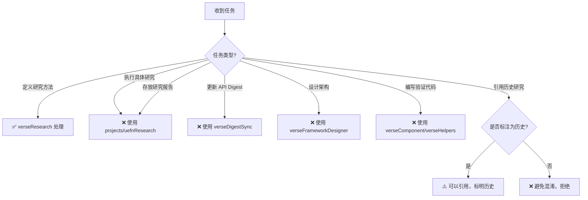

# verseResearch 能力边界文档

> **版本**: 2.0.0  
> **更新日期**: 2026-01-06  
> **核心定义**: verseResearch 是方法论技能，定义"如何研究"，不存放研究成果

---

## 能做的事（绿灯区）

### 1. 研究方法指导

| 类别 | 具体能力 | 说明 |
|------|----------|------|
| **问题定义** | 使用 SMART 原则定义研究问题 | 帮助明确具体、可衡量的研究目标 |
| **资料查找** | 提供信息源优先级和查找路径 | 指导从 API Digest → 官方文档 → 社区资源 |
| **假设验证** | 提供验证循环和实验设计方法 | 形成假设 → 编写代码 → 验证 → 更新假设 |
| **文档输出** | 提供研究报告结构和质量标准 | 统一的研究报告格式和评审标准 |

### 2. 研究价值评估

| 类别 | 具体能力 | 说明 |
|------|----------|------|
| **值得研究** | 判断主题是否值得投入时间研究 | 能力边界、性能瓶颈、设计模式、API 差异 |
| **不值得研究** | 识别低价值或已有答案的主题 | 已有文档、一次性问题、简单 API、猜测性功能 |
| **优先级排序** | 根据价值和紧迫性排序研究主题 | 影响架构决策 &gt; 性能优化 &gt; 最佳实践 |

### 3. 研究流程规范

| 类别 | 具体能力 | 说明 |
|------|----------|------|
| **流程定义** | 从问题识别到成果沉淀的完整流程 | 7 个阶段：识别 → 定义 → 查找 → 假设 → 验证 → 输出 → 沉淀 |
| **检查清单** | 各阶段的检查项 | 研究启动前、过程中、完成后的检查项 |
| **质量标准** | 研究报告的质量要求 | 结论有依据、边界明确、代码可复用、引用源头 |

---

## 不能做的事（红灯区）

### 1. 存放研究成果

| 类别 | 限制说明 | 替代方案 |
|------|----------|----------|
| **研究报告** | verseResearch 不存放具体研究报告 | 使用 `projects/uefnResearch/` 项目存放 |
| **验证代码** | 不在此技能下编写验证代码 | 验证代码放在 `verse/library` 或 `verse/modules` |
| **调研数据** | 不存放原始调研数据和笔记 | 使用 `projects/uefnResearch/progress/` 记录 |

**原因**：技能定位为方法论，而非研究成果仓库

### 2. 执行具体研究任务

| 类别 | 限制说明 | 替代方案 |
|------|----------|----------|
| **API 调研** | 不替代 verseDigestSync 更新 API | 使用 verseDigestSync 同步 API |
| **架构设计** | 不替代 verseFrameworkDesigner 设计架构 | 研究结论供架构设计参考 |
| **代码实现** | 不替代 verseComponent/verseHelpers 编写代码 | 研究产出模块由对应技能实现 |

**原因**：verseResearch 提供方法，其他技能执行具体工作

### 3. 做技术决策

| 类别 | 限制说明 | 替代方案 |
|------|----------|----------|
| **架构选型** | 不直接决定使用哪种架构 | 提供研究结论，由 verseFrameworkDesigner 决策 |
| **性能权衡** | 不直接决定性能优化方案 | 提供性能数据，由项目团队权衡决策 |
| **API 选择** | 不直接决定使用哪个 API | 提供 API 边界，由开发者根据需求选择 |

**原因**：研究提供事实和数据，决策由使用者根据具体场景做出

---

## 有条件能做的事（黄灯区）

### 1. 引用历史研究成果

| 条件 | 可以做的事 | 限制 |
|------|-----------|------|
| **历史报告参考** | 引用 `verseResearch/reports/` 的历史研究 | 仅作为参考，新研究不再存放此处 |
| **迁移说明** | 说明研究成果已迁移到 `projects/uefnResearch/` | 明确标注为历史遗留 |
| **向后兼容** | 保留历史报告供查阅 | 不再更新，仅保留只读 |

**判断标准**：是否明确标注为历史参考，不引起混淆

### 2. 提供研究模板

| 条件 | 可以做的事 | 限制 |
|------|-----------|------|
| **通用模板** | 提供研究报告的文档模板 | 模板本身不是研究成果 |
| **检查清单** | 提供研究过程的检查清单 | 清单本身不包含具体研究结论 |
| **流程图** | 提供研究流程的可视化图表 | 流程图描述方法，不是研究结果 |

**判断标准**：是否为方法论的一部分（模板、清单、流程），而非具体研究

### 3. 指导跨技能协作

| 条件 | 可以做的事 | 限制 |
|------|-----------|------|
| **研究链路** | 说明研究与其他技能的协作关系 | 不替代其他技能的职责 |
| **成果流转** | 定义研究成果如何流转到代码库 | 不执行流转，仅定义流程 |
| **质量标准** | 定义研究成果的交付标准 | 不评审具体研究报告 |

**判断标准**：是否定义协作方式和标准，而非执行协作任务

---

## 边界场景决策树



---

## 能力验证方法

### 如何验证是否在能力范围内？

| 问题 | 如果回答"是"，则... |
|------|-------------------|
| 这是在指导"如何研究"吗？ | ✅ 属于 verseResearch |
| 这是具体的研究成果吗？ | ❌ 应使用 projects/uefnResearch |
| 这是在定义研究流程吗？ | ✅ 属于 verseResearch |
| 这是在编写验证代码吗？ | ❌ 应使用 verse/library 或 verse/modules |
| 这是在做架构决策吗？ | ❌ 应使用 verseFrameworkDesigner |

---

## 与其他技能的能力边界

| 技能 | verseResearch 的边界 | 其他技能的边界 |
|------|---------------------|----------------|
| **projects/uefnResearch** | 提供研究方法论 | 执行具体研究，产出报告 |
| **verseDigestSync** | 指导如何使用 API Digest 进行研究 | 更新和同步 API Digest 文件 |
| **verseFrameworkDesigner** | 提供架构相关的研究结论 | 基于研究结论设计具体架构 |
| **verseComponent** | 提供 Component 设计的研究发现 | 编写具体的 Component 代码 |
| **verse/library** | 指导如何验证和测试模块 | 存放验证通过的可复用模块 |

---

## 能力边界的演进

### 当前版本 (v2.0.0)

- ✅ 定义为纯方法论技能
- ✅ 研究成果迁移到 projects/uefnResearch
- ✅ 保留历史报告作为参考

### 未来可能的扩展

| 扩展方向 | 可行性 | 前提条件 |
|---------|--------|----------|
| **研究模板库** | 高 | 积累更多研究模板 |
| **研究质量评审** | 中 | 定义明确的评审标准 |
| **自动化工具集成** | 中 | 开发研究辅助工具 |
| **跨项目研究索引** | 低 | 需要更复杂的组织结构 |

---

## 常见误用场景

### ❌ 错误使用

```markdown
# 错误：将研究报告放在 verseResearch 下
skills/verseDev/verseResearch/reports/R02-NewResearch/
```

**正确做法**：

```markdown
# 正确：将研究报告放在 uefnResearch 项目下
projects/uefnResearch/architecture/R02-NewResearch/
```

#### 错误示例 2: 在 verseResearch 中编写验证代码

```markdown
# 错误：在 verseResearch 中编写验证代码
skills/verseDev/verseResearch/code/test-component.verse
```

**正确做法**：

```markdown
# 正确：验证代码放在 verse/library 或 verse/modules
verse/library/test-component.verse
```

#### 错误示例 3: 用 verseResearch 做架构决策

```markdown
# 错误：用 verseResearch 做架构决策
"verseResearch 决定使用 SceneGraph 架构"
```

**正确做法**：

```markdown
# 正确：verseResearch 提供研究结论，verseFrameworkDesigner 做决策
"verseResearch 研究显示 SceneGraph 适合 Component 化场景"
"verseFrameworkDesigner 基于研究结论，决定使用 SceneGraph"
```

---

## 边界变更日志

### v2.0.0 (2026-01-06)

**重大变更**：

- 从"研究成果存放"转变为"研究方法论"
- 研究成果迁移到 `projects/uefnResearch/`
- 历史报告保留为参考

**能力调整**：

- ➕ 新增：研究方法指导、价值评估、流程规范
- ➖ 移除：存放研究报告、存放验证代码、存放调研数据
- ⚠️ 限制：仅引用历史报告，不再更新

---

*最后更新: 2026-01-06*  
*文档版本: 2.0.0*
