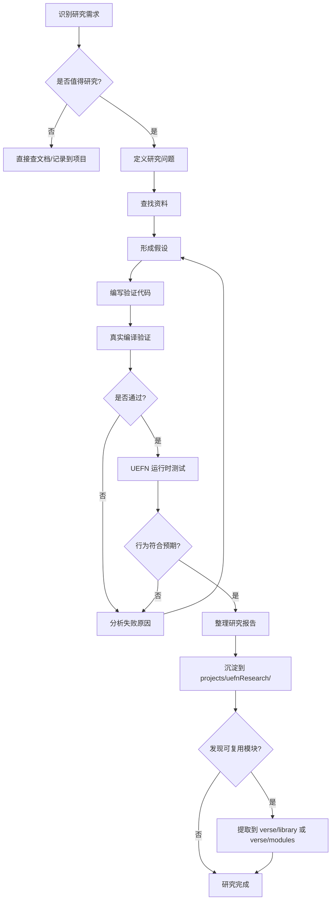

# Verse Research（Verse 技术研究）

> **类型**: 方法论技能  
> **职责**: 定义研究流程、资料查找、边界探索、原理验证、文档输出  
> **定位**: **方法论指南**，而非研究成果存放处

---

## 🎯 技能定位

**verseResearch 是"如何研究"的指南，不是"研究成果"的存放处。**

- ✅ **本技能提供**：研究方法、流程、标准、最佳实践
- ❌ **本技能不存放**：具体的研究报告、技术调研结论
- 📦 **研究成果位置**：`projects/uefnResearch/` 项目

---

## 📚 核心职责

### 1. 定义研究价值

**什么值得研究？**

| 类型 | 说明 | 示例 |
|------|------|------|
| **能力边界** | API/框架的能力极限 | SceneGraph vs Device 边界 |
| **性能瓶颈** | 影响游戏性能的关键点 | 大量 Entity 的性能开销 |
| **设计模式** | 可复用的架构模式 | Component 继承 vs 组合 |
| **API 差异** | 不同版本的 API 变化 | UEFN 版本间的 Breaking Changes |
| **未文档化行为** | 官方文档未明确的行为 | 生命周期钩子的调用顺序 |

**什么不值得研究？**

| 类型 | 原因 | 替代方案 |
|------|------|----------|
| **已有明确文档** | 官方文档已详细说明 | 直接引用官方文档 |
| **一次性问题** | 特定项目的特殊问题 | 在项目文档中记录 |
| **简单 API 用法** | 直接调用即可 | 代码示例即可，无需研究 |
| **未发布的功能** | 无法验证的功能 | 等待官方发布后再研究 |

---

## 🔬 研究方法论

### 阶段 1: 定义研究问题

**SMART 原则**：

- **Specific**（具体）：明确研究的具体问题
- **Measurable**（可衡量）：有明确的验证标准
- **Achievable**（可实现）：在现有条件下可完成
- **Relevant**（相关）：对实际开发有价值
- **Time-bound**（有时限）：设定研究时间限制

**问题模板**：

```markdown
## 研究问题

**背景**：为什么需要研究这个问题？
**问题陈述**：具体要回答什么问题？
**预期产出**：研究完成后会得到什么？
**价值评估**：这个研究对项目的价值是什么？
```

---

### 阶段 2: 资料查找

**信息源优先级**：

```
1. 官方 API Schema / Digest 文件  ← 最权威
2. 官方文档的技术章节
3. Changelog / Release Notes
4. 官方示例项目
5. GitHub Issues / Discussions
6. 社区博客和教程  ← 最真实，但需验证
```

**关键资料位置**：

| 资料类型 | 位置 | 用途 |
|---------|------|------|
| **Verse API Digest** | `skills/verseDev/shared/api-digests/Verse.digest.verse` | 语言核心、SceneGraph、Simulation |
| **Fortnite API Digest** | `skills/verseDev/shared/api-digests/Fortnite.digest.verse` | UI、Devices、Characters、AI |
| **UnrealEngine API Digest** | `skills/verseDev/shared/api-digests/UnrealEngine.digest.verse` | Itemization、SpatialMath、Widgets |
| **官方文档** | [UEFN Documentation](https://dev.epicgames.com/documentation/en-us/fortnite) | 概念说明、教程 |
| **社区资源** | [Awesome Verse](https://github.com/spilth/awesome-verse) | 社区最佳实践 |

---

### 阶段 3: 假设与验证

**研究循环**：

```
形成假设 → 设计验证实验 → 编写测试代码 → 观察结果 → 更新假设
    ↑                                                        ↓
    └────────────────── 循环直到确认 ────────────────────────┘
```

**验证原则**：

1. **最小化原型**：只测试核心问题，避免无关复杂性
2. **对照实验**：对比不同实现方式的差异
3. **边界测试**：测试极端情况（空值、极大值、边界条件）
4. **真实编译**：使用 `tools/verseCompiler` 验证代码可编译
5. **运行时验证**：在 UEFN 编辑器中实际运行测试

**验证检查清单**：

- [ ] 代码能编译通过
- [ ] 运行时行为符合预期
- [ ] 边界情况已测试
- [ ] 性能影响已评估（如适用）
- [ ] 是否有未文档化的副作用

---

### 阶段 4: 文档输出

**研究报告结构**（位于 `projects/uefnResearch/`）：

```markdown
# [研究主题]

## 研究背景
为什么研究这个问题？

## 研究问题
具体要回答什么？

## 研究方法
如何进行验证？

## 研究发现
1. 核心结论
2. 边界与限制
3. 最佳实践

## 验证代码
引用 verse/ 代码库中的验证代码

## 参考资料
官方文档、API 文件、社区资源

## 决策影响
这个研究对架构/设计的影响
```

**文档质量标准**：

- ✅ 结论有明确的验证依据（代码/官方文档）
- ✅ 边界和限制明确列出
- ✅ 提供可复用的代码示例
- ✅ 引用源头（官方文档链接、API 文件位置）
- ❌ 避免主观推测，无依据的结论

---

## 🔍 研究边界

### ✅ 适合研究的主题

- **架构边界**：SceneGraph 能做什么，不能做什么
- **性能特性**：不同实现方式的性能差异
- **API 行为**：未明确文档的行为细节
- **设计模式**：可复用的架构模式
- **迁移指南**：从旧模式到新模式的迁移路径

### ❌ 不适合研究的主题

- **基础语法**：Verse 语言的基本语法（查官方文档即可）
- **简单 API**：直接调用即可的 API（不需要深度研究）
- **项目特定问题**：只在某个项目中出现的问题（记录在项目文档）
- **猜测性功能**：没有官方文档的未发布功能（无法验证）

---

## 📊 研究流程图



---

## 🔗 与其他技能的关系

```
verseResearch (方法论)
    ↓ 指导研究流程
projects/uefnResearch (研究项目)
    ↓ 产出研究报告
verse/library & verse/modules (代码库)
    ↓ 提供可复用模块
trophyFishing & 其他游戏项目 (应用)
```

| 技能/项目 | 关系 | 说明 |
|----------|------|------|
| **verseResearch** | 方法论 | 定义如何研究 |
| **projects/uefnResearch** | 研究项目 | 存放研究成果 |
| **verseDigestSync** | 资料更新 | 同步最新 API Digest |
| **verseFrameworkDesigner** | 架构设计 | 应用研究结论于架构 |
| **verse/library** | 代码库 | 研究产出的可复用模块 |

---

## 📦 历史研究成果参考

**注意**：以下研究报告是历史参考，存放在 `verseResearch/reports/`，未来研究成果应放在 `projects/uefnResearch/`。

### R00: SceneGraph 与 Device 边界研究

**位置**：`verseResearch/reports/R00-SceneGraph-Device-Boundary/`

**核心结论**：
- SG 能力边界 = Component 化边界
- 可 Component 化 → 优先使用 SceneGraph
- 不可 Component 化 → 必须使用 Device
- 混合架构 → Component 管理逻辑 + Device 提供能力

**价值**：为架构设计提供决策依据

### R01: Component 继承与组合模式研究

**位置**：`verseResearch/reports/R01-Component-Inheritance-Composition/`

**核心结论**：
- 继承模式适用于强关联、层级清晰的场景
- 组合模式适用于灵活组合、多变需求的场景

**价值**：为 Component 设计提供模式指导

---

## 💡 最佳实践

### 1. 研究启动前

- [ ] 明确研究问题（使用 SMART 原则）
- [ ] 检查是否已有现成研究（避免重复）
- [ ] 评估研究价值（时间 vs 收益）
- [ ] 准备验证环境（UEFN 编辑器、远程编译）

### 2. 研究过程中

- [ ] 保持最小化原型（只测试核心问题）
- [ ] 记录所有假设和验证结果
- [ ] 引用权威源头（官方文档、API Digest）
- [ ] 及时更新研究笔记

### 3. 研究完成后

- [ ] 整理研究报告到 `projects/uefnResearch/`
- [ ] 提取可复用代码到 `verse/library` 或 `verse/modules`
- [ ] 更新相关技能文档（如影响架构设计）
- [ ] 记录研究过程中的踩坑（FAILURE-CASES.md）

---

## 🚨 常见陷阱

### 陷阱 1: 研究范围过大

**症状**：研究一个主题，却涉及多个不相关的子主题

**解决**：拆分为多个独立研究，逐个击破

### 陷阱 2: 缺乏验证

**症状**：得出结论但未编写验证代码

**解决**：所有结论必须有对应的验证代码

### 陷阱 3: 过度推测

**症状**：基于猜测得出结论，缺乏权威依据

**解决**：明确区分"已验证的事实"和"推测"

### 陷阱 4: 研究成果散落

**症状**：研究笔记散落各处，难以查找

**解决**：统一存放在 `projects/uefnResearch/`

---

## 📞 相关资源

### 内部资源

- [projects/uefnResearch/](../../../projects/uefnResearch/) - 研究项目
- [skills/verseDev/shared/api-digests/](../shared/api-digests/) - API 摘要文件
- [verse/library/](../../../verse/library/) - 通用代码库
- [verse/modules/](../../../verse/modules/) - 功能模块

### 外部资源

- [UEFN 官方文档](https://dev.epicgames.com/documentation/en-us/fortnite)
- [Verse 语言参考](https://dev.epicgames.com/documentation/en-us/fortnite/verse-language-reference)
- [SceneGraph 概述](https://dev.epicgames.com/documentation/en-us/fortnite/scene-graph-in-unreal-editor-for-fortnite)
- [Awesome Verse](https://github.com/spilth/awesome-verse)

---

## 📝 快速启动模板

创建新研究时，使用此模板：

```markdown
# [研究主题]

## 研究背景
- 为什么需要研究？
- 当前遇到什么问题？

## 研究问题
- 具体要回答什么问题？

## 研究方法
- 如何验证？
- 需要哪些实验？

## 研究发现
### 核心结论
- 结论 1
- 结论 2

### 边界与限制
- 限制 1
- 限制 2

### 最佳实践
- 建议 1
- 建议 2

## 验证代码
```verse
// 引用 verse/ 代码库中的验证代码
```

## 参考资料
- 官方文档链接
- API 文件位置

## 决策影响
- 对架构的影响
- 对设计的影响
```

---

*最后更新: 2026-01-06*  
*技能版本: 2.0.0*
