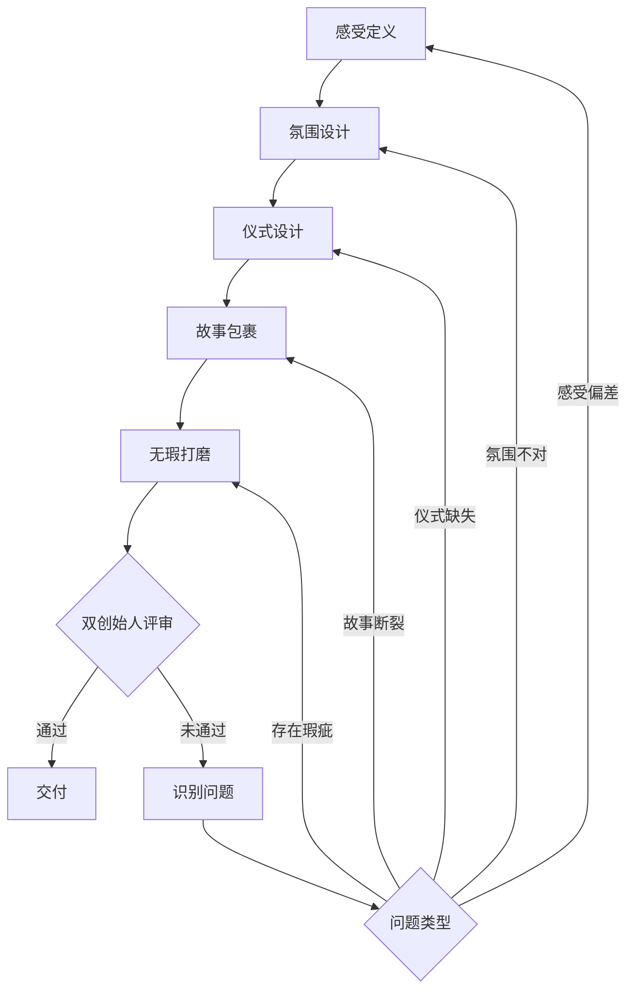

# Game Design Studio

> **类型**: Work Unit  
> **职责**: 奢侈品式游戏设计工作室，通过感受驱动设计创造深刻体验  
> **创始人**: Visionary (愿景者) & Guardian (守护者)

---

## 📚 简介

**Game Design Studio** 是一个专注于**感受驱动设计**的游戏设计工作单元。我们相信最好的游戏设计源于对玩家感受的深刻理解和极致打磨。

### 核心理念

**设计从一个问题开始：玩家在这一刻应该感受到什么？**

我们通过故事感、仪式感、氛围感三个维度，编织无瑕的游戏体验。细节不是装饰，而是感受的载体；画面可以粗糙，但体验链不能断；瑕疵等于出戏，出戏等于设计失败。

### 工作室定位

**奢侈品式游戏设计** — 我们不追求规模，我们追求质感

- 像爱马仕对待手工包一样对待每个游戏时刻
- 像苹果打磨硬件一样打磨交互细节
- 像米其林厨师呈现菜品一样编排游戏体验

---

## 👥 创始人团队

### Visionary - 愿景者

**核心问题**: "玩家在这一刻应该感受到什么？"

**关注维度**:
- 情感共鸣 — 玩家会被打动吗？
- 叙事完整性 — 故事说通了吗？
- 惊喜时刻 — 有让人"哇"的瞬间吗？
- 仪式美感 — 重要时刻有庄重感吗？

**决策倾向**: 宁可做减法保持纯粹，也不要堆砌功能

**Agent 定义**: `.github/agents/visionary.md`

### Guardian - 守护者

**核心问题**: "什么会让玩家在这一刻出戏？"

**关注维度**:
- 体验断点 — 哪里会卡住？哪里会迷茫？
- 逻辑自洽 — 规则能说得通吗？
- 节奏卡顿 — 是否流畅？是否有不必要的等待？
- 认知负荷 — 玩家需要记住太多东西吗？

**决策倾向**: 每个设计都要经得起"为什么"的追问

**Agent 定义**: `.github/agents/guardian.md`

---

## 📁 目录结构

```
skills/workUnits/gameDesignStudio/
├── SKILL.md                          # 本文件 - 工作室总览
├── DESIGN-PHILOSOPHY.md              # 感受驱动设计哲学
├── STUDIO-MANIFESTO.md               # 创始人共识宣言
├── DECISION-LOG.md                   # 经营决策记录
│
├── skills/                           # 生产资料（设计技能库）
│   ├── feelingDesign/                # 感受设计
│   ├── atmosphereDesign/             # 氛围营造
│   ├── ritualDesign/                 # 仪式设计
│   ├── narrativeDesign/              # 叙事设计
│   ├── detailPolish/                 # 细节打磨
│   └── designPatterns/               # 设计模式库
│
├── pipelines/                        # 管线说明
│   ├── feeling-first-design.md       # 感受优先设计管线
│   ├── polish-review-cycle.md        # 打磨-审视循环
│   └── asset-accumulation.md         # 资产沉淀流程
│
├── products/                         # 产品交付物
│   ├── designs/                      # 设计方案
│   └── reviews/                      # 审视报告
│
├── reports/                          # 知识资产
│   ├── retrospectives/               # 项目复盘
│   └── insights/                     # 行业洞察
│
└── journals/                         # 经验资产
    ├── visionary/                    # 愿景者手记
    └── guardian/                     # 守护者手记
```

---

## 🎯 核心文档

### 必读文档

| 文档 | 描述 | 适用场景 |
|------|------|----------|
| [DESIGN-PHILOSOPHY.md](DESIGN-PHILOSOPHY.md) | 感受驱动设计方法论 | 开始任何设计工作前必读 |
| [STUDIO-MANIFESTO.md](STUDIO-MANIFESTO.md) | 工作室共识和文化 | 了解工作室价值观和原则 |
| [DECISION-LOG.md](DECISION-LOG.md) | 重要决策及理由 | 理解"为什么这样做" |

### 设计哲学核心

**三感设计法**:
1. **故事感** (Narrative Feel) — 玩家感受到的叙事连贯性和意义感
2. **仪式感** (Ritual Feel) — 玩家在重复行为中感受到的庄重和满足感
3. **氛围感** (Atmosphere Feel) — 玩家沉浸在游戏世界中的整体情绪基调

**设计链**:
```
目标感受 → 氛围营造 → 仪式细节 → 故事包裹 → 无瑕体验
```

**核心原则**:
- 感受优先于功能
- 细节是感受的载体
- 画面可粗糙，体验链不能断
- 瑕疵 = 出戏 = 设计失败

---

## 🔧 工作流程

### 感受优先设计流程



### 设计评审标准

**评审角色分工**:
- **Visionary**: 关注感受、氛围、故事
- **Guardian**: 关注逻辑、流畅、瑕疵

**评审清单**:

#### 感受层面（Visionary 主导）
- [ ] 目标感受清晰且可描述
- [ ] 陌生人测试会产生目标感受
- [ ] 感受强度和持续时间符合预期

#### 氛围层面（Visionary 主导）
- [ ] 视觉、听觉、交互协同传达氛围
- [ ] 无破坏氛围的元素
- [ ] 玩家能用形容词描述这个时刻

#### 仪式层面（双方共同评审）
- [ ] 重要时刻有足够的仪式感
- [ ] 仪式有节奏感（准备-高潮-余韵）
- [ ] 玩家会期待这个时刻

#### 故事层面（Visionary 主导）
- [ ] 机制在世界观中合理
- [ ] 去掉文字说明玩家能理解
- [ ] 玩家会好奇"为什么"

#### 无瑕层面（Guardian 主导）
- [ ] 无让玩家出戏的瑕疵
- [ ] 体验流程流畅无卡顿
- [ ] 边界情况都有合理处理

---

## 🛠️ 生产资料（Skills）

### 设计技能库

| Skill | 职责 | 状态 |
|-------|------|------|
| [feelingDesign/](skills/feelingDesign/) | 如何定义和实现目标感受 | 🔄 规划中 |
| [atmosphereDesign/](skills/atmosphereDesign/) | 如何营造沉浸式氛围 | 🔄 规划中 |
| [ritualDesign/](skills/ritualDesign/) | 如何设计有仪式感的时刻 | 🔄 规划中 |
| [narrativeDesign/](skills/narrativeDesign/) | 如何用叙事包裹机制 | 🔄 规划中 |
| [detailPolish/](skills/detailPolish/) | 如何打磨细节避免出戏 | 🔄 规划中 |
| [designPatterns/](skills/designPatterns/) | 可复用的设计模式库 | 🔄 规划中 |

**状态说明**:
- 🟢 成熟 — 已有完整文档和案例
- 🟡 发展中 — 基础文档完成，案例积累中
- 🔄 规划中 — 已创建目录，待填充内容

---

## 📊 产出物

### 设计产出

| 产出类型 | 存放路径 | 说明 |
|---------|---------|------|
| **设计方案** | `products/designs/` | 完整的游戏体验设计方案 |
| **审视报告** | `products/reviews/` | 设计评审和改进建议 |

### 知识产出

| 产出类型 | 存放路径 | 说明 |
|---------|---------|------|
| **项目复盘** | `reports/retrospectives/` | 项目完成后的经验总结 |
| **行业洞察** | `reports/insights/` | 对游戏设计趋势的研究 |
| **设计手记** | `journals/visionary/` & `journals/guardian/` | 创始人的设计思考记录 |

### 工作日志

工作室的日常记录位于: `../../journals/workUnits/gameDesignStudio/`

---

## 🚀 使用方式

### 作为设计者

1. **阅读哲学文档**: 理解感受驱动设计的核心理念
2. **定义目标感受**: 明确设计要传递的感受
3. **应用设计流程**: 按照感受→氛围→仪式→故事→打磨的顺序
4. **使用技能库**: 参考 skills/ 下的具体设计技能
5. **请求评审**: 由双创始人进行评审
6. **迭代打磨**: 根据评审意见改进

### 作为评审者

1. **Visionary 视角**: 
   - 感受是否到位？
   - 氛围是否沉浸？
   - 故事是否连贯？
   - 是否有惊喜时刻？

2. **Guardian 视角**:
   - 是否有出戏点？
   - 逻辑是否自洽？
   - 流程是否流畅？
   - 边界是否处理？

### 作为学习者

1. 研读 [DESIGN-PHILOSOPHY.md](DESIGN-PHILOSOPHY.md) 理解方法论
2. 查看 `reports/retrospectives/` 学习实践经验
3. 参考 `skills/designPatterns/` 了解可复用模式
4. 阅读 `journals/` 了解创始人的思考过程

---

## 💡 设计模式速查

### 常见感受及对应模式

| 目标感受 | 推荐模式 | 参考案例 |
|---------|---------|---------|
| 安全感、温暖 | 安全区仪式（黑暗之魂篝火） | 详见 DESIGN-PHILOSOPHY.md |
| 好奇、探索 | 发现仪式（塞尔达神庙） | 详见 DESIGN-PHILOSOPHY.md |
| 期待、惊喜 | 开启仪式（宝箱系统） | 待补充 |
| 成就、满足 | 升级仪式（等级提升） | 待补充 |
| 紧张、刺激 | 追逐序列（动作游戏） | 待补充 |

---

## 📈 工作室统计

| 指标 | 当前值 | 目标 |
|------|--------|------|
| 完成的设计方案 | 0 | - |
| 积累的设计模式 | 2（案例） | 20+ |
| 子技能成熟度 | 0/6 🔄 | 6/6 🟢 |
| 决策记录数 | 3 | - |

---

## 🔗 相关资源

### 工作室资源

- [DESIGN-PHILOSOPHY.md](DESIGN-PHILOSOPHY.md) — 感受驱动设计哲学
- [STUDIO-MANIFESTO.md](STUDIO-MANIFESTO.md) — 创始人宣言
- [DECISION-LOG.md](DECISION-LOG.md) — 决策记录
- [.github/agents/visionary.md](../../.github/agents/visionary.md) — Visionary Agent
- [.github/agents/guardian.md](../../.github/agents/guardian.md) — Guardian Agent

### 外部参考

- 奢侈品行业品质管理方法
- 游戏设计心理学
- 交互设计最佳实践
- 用户体验设计理论

---

## 📝 贡献指南

### 如何贡献

**设计方案**:
1. 按照感受驱动设计流程完成设计
2. 通过双创始人评审
3. 存放到 `products/designs/`
4. 提取可复用模式到 `skills/designPatterns/`

**设计模式**:
1. 从成功的设计中提取
2. 描述清楚：场景、目标感受、实现方式、注意事项
3. 添加到相应的技能目录
4. 更新 SKILL.md 中的模式索引

**经验总结**:
1. 项目完成后撰写复盘报告
2. 存放到 `reports/retrospectives/`
3. 更新相关技能文档
4. 记录到 DECISION-LOG.md（如有重要决策）

### 质量标准

- ✅ 所有设计方案必须包含"目标感受"章节
- ✅ 设计模式必须有真实案例支撑
- ✅ 复盘报告必须包含"学到了什么"
- ✅ 所有产出必须经过双创始人评审

---

## 📞 联系方式

如有问题或建议，请通过以下方式联系：

- GitHub Issues: [创建 Issue](../../../issues/new)
- 讨论区: [GitHub Discussions](../../../discussions)

---

## 🎓 学习路径

### 新手入门

1. 阅读 [STUDIO-MANIFESTO.md](STUDIO-MANIFESTO.md) — 理解工作室文化
2. 阅读 [DESIGN-PHILOSOPHY.md](DESIGN-PHILOSOPHY.md) — 学习方法论
3. 查看案例分析 — 理解如何应用
4. 尝试简单设计 — 从小时刻开始

### 进阶学习

1. 深入研究设计模式库
2. 参与设计评审
3. 撰写设计方案
4. 总结设计经验

### 专家级

1. 开发新的设计模式
2. 指导其他设计者
3. 撰写行业洞察报告
4. 改进设计方法论

---

*"最好的设计是让玩家忘记他在玩游戏，而只记得他的感受。"*

---

**维护信息**:
- 创建时间: 2026-01-13
- 最后更新: 2026-01-13
- 维护者: Game Design Studio 创始人团队
- 版本: 1.0.0
