# Skills 维护重构指南

> **类型**: Work Unit 子 Skill - 维护技能  
> **职责**: 提供 Skills 重构的方法论和触发机制  
> **维护者**: `workflow-case-study` 工作流自动维护

---

## 📚 简介

随着 Skills 的持续积累，单个 Skill 文件可能变得庞大、冗余、难以维护。本 Skill 提供系统化的重构方法论，帮助 Agent 识别何时需要重构以及如何重构。

**核心理念**: **持续演进 > 一次完美。Skills 应该随着理解的深入而重构。**

---

## 🚨 重构触发信号

### 强信号（必须重构）

当出现以下任一信号时，**必须进入重构模式**：

| 信号 | 判断标准 | 示例 |
|------|----------|------|
| **文件过大** | 单个 SKILL.md 超过 500 行 | workflowAnalyzer/SKILL.md 达到 600 行 |
| **内容重复** | 相同或类似内容出现 3 次以上 | 多个设计模式描述了类似的配置模式 |
| **结构混乱** | 章节层级超过 4 层，或章节无逻辑顺序 | ### 2.3.1.1.1 无法理解的深层嵌套 |
| **查找困难** | 人工查找特定信息需要超过 2 分钟 | "我记得有个模式，但找不到在哪" |
| **版本冲突频繁** | 多次研究更新同一部分导致冲突 | 设计模式表格被反复修改 |

### 弱信号（建议重构）

当出现以下信号时，**建议考虑重构**：

| 信号 | 判断标准 | 应对策略 |
|------|----------|----------|
| **更新频率低** | 某个章节连续 10 次研究都未更新 | 可能内容已饱和或不再相关 |
| **信息过时** | 内容基于旧版本 gh-aw，已有新版本 | 需要归档旧内容，更新新内容 |
| **抽象层级不一致** | 混合高层模式和低层实现细节 | 需要分层重构 |
| **缺少索引** | 无法快速定位相关内容 | 添加目录、索引或拆分文件 |

---

## 🛠️ 三种重构策略

### 策略 1: 垂直拆分（推荐）

**适用场景**: 单个 Skill 承担了多个职责

**操作步骤**:

```
旧结构:
skills/workUnits/workflowCaseStudy/skills/workflowAnalyzer/
└── SKILL.md  (600 行，包含分析框架 + 设计模式 + 代码片段)

新结构:
skills/workUnits/workflowCaseStudy/skills/workflowAnalyzer/
├── SKILL.md  (主索引，200 行)
├── analysis-frameworks/  # 分析框架子目录
│   ├── frontmatter-analysis.md
│   ├── prompt-analysis.md
│   └── pattern-detection.md
├── design-patterns/  # 设计模式库
│   ├── INDEX.md  (模式索引)
│   ├── orchestrator-patterns.md
│   ├── security-patterns.md
│   └── collaboration-patterns.md
└── code-snippets/  # 代码片段库
    ├── INDEX.md
    ├── slash-command-examples.md
    └── safe-outputs-examples.md
```

**SKILL.md 转变为导航文件**:

```markdown
# Workflow Analyzer Skill

## 快速导航

### 📊 分析框架
- [Frontmatter 配置分析](analysis-frameworks/frontmatter-analysis.md)
- [Prompt 设计分析](analysis-frameworks/prompt-analysis.md)
- [设计模式识别](analysis-frameworks/pattern-detection.md)

### 🎨 设计模式库
- [模式索引](design-patterns/INDEX.md) - 按类别浏览所有模式
- [编排器模式](design-patterns/orchestrator-patterns.md)
- [安全模式](design-patterns/security-patterns.md)

### 💻 代码片段库
- [片段索引](code-snippets/INDEX.md)
- [Slash Command 示例](code-snippets/slash-command-examples.md)
```

**优点**:
- ✅ 清晰的职责分离
- ✅ 便于增量更新（只修改相关子文件）
- ✅ 减少版本冲突
- ✅ 便于查找和引用

**缺点**:
- ❌ 增加了文件数量
- ❌ 需要维护索引文件

---

### 策略 2: 知识压缩

**适用场景**: 内容冗余，可以提炼为更简洁的形式

**操作步骤**:

1. **识别冗余内容**
   - 查找重复的描述
   - 查找可以合并的相似模式
   - 查找可以表格化的列表

2. **提炼核心信息**
   ```markdown
   # 冗余前（100 行）
   ## Slash Command 模式
   Slash Command 模式适用于...（5 段描述）
   
   ### 示例 1
   （完整代码 20 行）
   
   ### 示例 2
   （完整代码 20 行）
   
   ### 示例 3
   （完整代码 20 行）
   
   # 压缩后（30 行）
   ## Slash Command 模式
   **适用场景**: 用户交互触发任务
   **核心配置**: `on: slash_command`
   
   | 场景 | 配置要点 | 参考案例 |
   |------|----------|----------|
   | 简单查询 | max: 1 comment | scout |
   | 复杂任务 | assign-to-agent | plan |
   | 多步骤 | lock-for-agent | campaign-generator |
   ```

3. **保留详细示例到单独文件**
   - 创建 `examples/` 目录
   - 移动完整代码到示例文件
   - 在 SKILL.md 中保留索引链接

**优点**:
- ✅ 显著减少文件大小
- ✅ 提高信息密度
- ✅ 更容易快速扫描

**缺点**:
- ❌ 可能丢失细节（需要保留到示例文件）
- ❌ 需要良好的抽象能力

---

### 策略 3: 归档陈旧内容

**适用场景**: 内容已过时但有历史价值

**操作步骤**:

1. **识别陈旧内容**
   - 基于旧版本 API 的模式
   - 已被新模式取代的旧模式
   - 不再推荐的实践

2. **创建归档目录**
   ```
   skills/workUnits/workflowCaseStudy/skills/workflowAnalyzer/
   ├── SKILL.md  (当前版本)
   └── archived/
       ├── CHANGELOG.md  (归档原因说明)
       ├── v1.0-SKILL.md  (2026-01-01 版本)
       └── deprecated-patterns.md  (已废弃模式)
   ```

3. **在 SKILL.md 中移除陈旧内容**
   - 删除或移动陈旧章节
   - 添加指向归档的链接（如果需要）
   - 在 CHANGELOG.md 中说明归档原因

**CHANGELOG.md 示例**:
```markdown
# Skill 归档日志

## 2026-01-09 - 归档早期设计模式

**归档原因**: 
- gh-aw v2.0 引入了新的 safe-outputs API
- 旧的 output-limiter 模式已被废弃

**归档内容**:
- `deprecated-patterns.md`: 包含 output-limiter 模式的详细说明
- `v1.0-SKILL.md`: 完整的 v1.0 版本快照

**影响**: 
- 当前 SKILL.md 从 580 行减少到 320 行
- 归档内容仍可查阅，但不会干扰日常使用
```

**优点**:
- ✅ 保留历史内容，可追溯
- ✅ 主文件保持简洁
- ✅ 明确标注内容状态

**缺点**:
- ❌ 增加维护复杂度
- ❌ 需要决策哪些内容应该归档

---

## 🌳 重构决策树

```mermaid
graph TD
    A[检测到重构信号] --> B{是强信号吗?}
    B -->|是| C[必须重构]
    B -->|否| D{弱信号数量 >= 3?}
    D -->|是| C
    D -->|否| E[继续调研模式]
    
    C --> F{主要问题是?}
    F -->|职责混乱| G[垂直拆分]
    F -->|内容冗余| H[知识压缩]
    F -->|内容过时| I[归档陈旧内容]
    
    G --> J[创建子目录结构]
    H --> K[提炼核心信息]
    I --> L[移动到 archived/]
    
    J --> M[更新 SKILL.md 为导航]
    K --> M
    L --> M
    
    M --> N[创建重构 PR]
    N --> O[标题: &#91;skills-refactor&#93;]
```



---

## 🔄 重构模式工作流程

### Phase R: 重构执行（新增到 workflow-case-study.md）

当 Agent 检测到重构强信号时，工作流会跳过调研流程，进入重构模式。

#### R.1 分析当前结构

```bash
# 检查 SKILL.md 文件大小和行数
wc -l skills/workUnits/workflowCaseStudy/skills/*/SKILL.md

# 检查最近更新频率
git log --oneline --since="3 months ago" -- skills/workUnits/workflowCaseStudy/skills/
```

**输出**:
- 哪些文件超过 500 行？
- 哪些文件最近频繁更新？
- 是否有明显的冲突历史？

#### R.2 选择重构策略

基于分析结果，选择合适的策略：

| 问题 | 策略 |
|------|------|
| 单文件 > 500 行 + 职责混合 | 垂直拆分 |
| 内容重复 > 3 处 | 知识压缩 |
| 内容基于旧版本 | 归档陈旧内容 |

#### R.3 执行重构

**垂直拆分示例**:

```bash
# 创建子目录
mkdir -p skills/workUnits/workflowCaseStudy/skills/workflowAnalyzer/design-patterns

# 提取设计模式到单独文件
# （手动编辑，将 SKILL.md 中的设计模式章节移动到 design-patterns/INDEX.md）

# 更新 SKILL.md 为导航格式
```

**知识压缩示例**:

```bash
# 备份原文件
cp SKILL.md SKILL.md.backup

# 编辑 SKILL.md，将冗余内容压缩为表格
# （手动编辑）

# 移动详细示例到 examples/ 目录
mkdir -p examples
```

#### R.4 验证重构结果

**检查清单**:
- [ ] 所有链接是否有效？
- [ ] 索引文件是否完整？
- [ ] 是否有内容丢失？
- [ ] 文件结构是否清晰？

#### R.5 创建重构 PR

**PR 标题格式**:
```
[skills-refactor] 重构 workflowAnalyzer - 垂直拆分设计模式库
```

**PR 描述模板**:

```markdown
## 🔧 重构概要

- **重构目标**: skills/workUnits/workflowCaseStudy/skills/workflowAnalyzer
- **重构策略**: 垂直拆分
- **触发信号**: SKILL.md 超过 600 行，设计模式混杂

## 📊 重构前后对比

| 指标 | 重构前 | 重构后 | 改进 |
|------|--------|--------|------|
| SKILL.md 行数 | 600 | 200 | ↓67% |
| 文件总数 | 1 | 8 | - |
| 查找时间（估计） | 2+ 分钟 | < 30 秒 | ↓75% |

## 🗂️ 新结构

```
workflowAnalyzer/
├── SKILL.md  (主索引)
├── analysis-frameworks/
│   ├── frontmatter-analysis.md
│   └── ...
├── design-patterns/
│   ├── INDEX.md
│   └── ...
└── code-snippets/
    └── ...
```

## ✅ 验证清单

- [x] 所有链接已验证
- [x] 索引文件完整
- [x] 无内容丢失
- [x] 文件结构清晰

## 📝 重构说明

{详细说明重构过程、移动的内容、新增的索引}

## 🔮 后续建议

{是否需要进一步重构其他 Skills？}
```

---

## 🎯 重构 vs 调研决策

**Agent 在每次运行时应该问自己**：

```mermaid
graph LR
    A[开始运行] --> B{检查重构信号}
    B -->|强信号| C[进入重构模式 Phase R]
    B -->|无强信号| D[进入调研模式 Phase 0-4]
    
    C --> E[创建 &#91;skills-refactor&#93; PR]
    D --> F[创建 &#91;workflow-study&#93; PR]
```



**决策原则**:
- **优先重构**: 如果 Skills 已经混乱，先整理再继续积累
- **定期评估**: 每 5-10 次调研后，评估一次重构需求
- **不要过度**: 重构是手段不是目的，适度即可

---

## 📊 重构效果评估

重构完成后，应该能够回答：

### 量化指标

| 指标 | 目标 | 测量方法 |
|------|------|----------|
| **文件大小** | 单文件 < 500 行 | `wc -l SKILL.md` |
| **查找时间** | < 1 分钟找到目标信息 | 人工测试 |
| **更新冲突率** | < 10% PR 有冲突 | Git 历史分析 |
| **信息密度** | 核心信息占比 > 80% | 删除冗余内容比例 |

### 质性评估

- ✅ 结构是否清晰？
- ✅ 导航是否便捷？
- ✅ 职责是否分离？
- ✅ 更新是否便利？

---

## 💡 最佳实践

### ✅ 应该做

1. **渐进式重构**: 每次重构一个 Skill，不要全部重构
2. **保留历史**: 归档而非删除，保留可追溯性
3. **更新索引**: 重构后立即更新所有索引和链接
4. **记录理由**: 在 PR 中详细说明重构原因和效果
5. **验证链接**: 重构后检查所有交叉引用是否有效

### ❌ 不应该做

1. **过度拆分**: 不要拆分成几十个小文件，维护成本高
2. **丢失信息**: 重构时要保留所有有价值的内容
3. **破坏引用**: 重构后确保其他文件的引用不失效
4. **频繁重构**: 不要每次都重构，给 Skills 时间积累
5. **为重构而重构**: 重构必须解决实际问题，不是追求完美

---

## 🔗 相关资源

- [workflow-case-study.md](../../../.github/workflows/workflow-case-study.md) - 主工作流
- [RESEARCH-AGENDA.md](../../RESEARCH-AGENDA.md) - 研究议程
- [workflowAnalyzer/SKILL.md](../workflowAnalyzer/SKILL.md) - 分析技能
- [workflowAuthoring/SKILL.md](../workflowAuthoring/SKILL.md) - 创作技能

---

*最后更新: 2026-01-09*  
*版本: 1.0.0*
